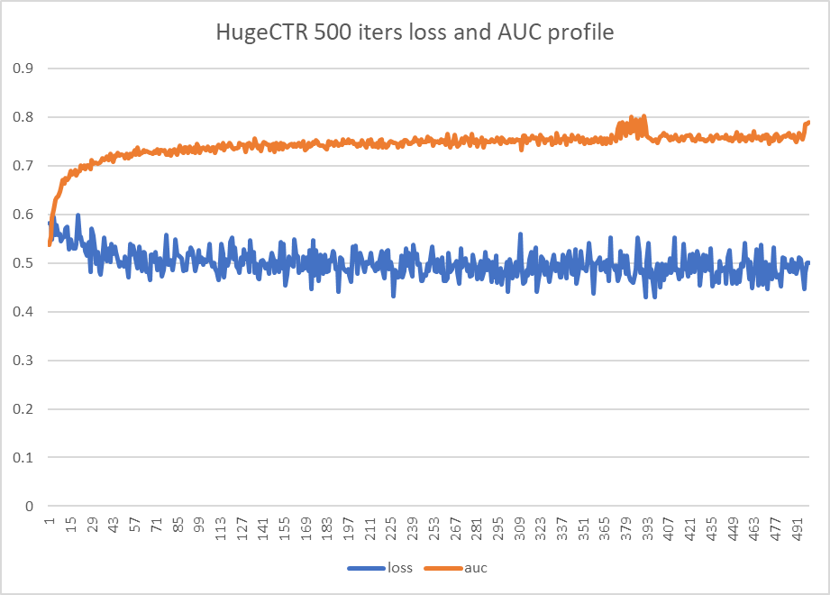
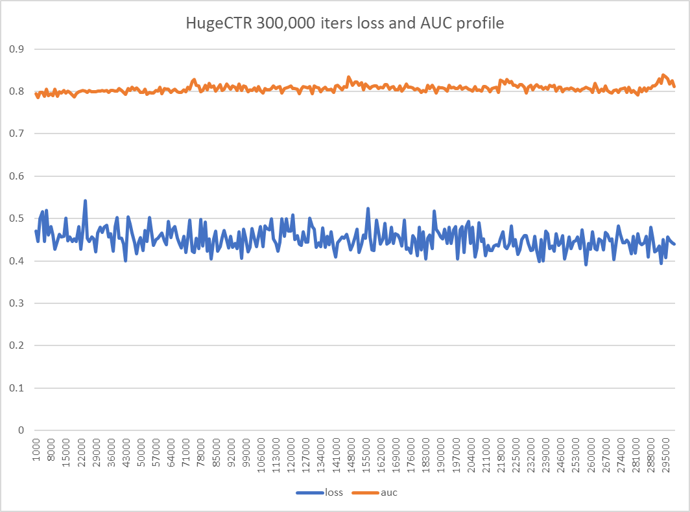

# HugeCTR test report on one node with 8 x Tesla V100 
This report summarized HugeCTR test on one node with 8 x Tesla V100 on Sep 8th 2020.

## Test Environment
- Tesla V100-SXM2-16GB x 8
- InfiniBand 100 Gb/sec (4X EDR)， Mellanox Technologies MT27700 Family
- Intel(R) Xeon(R) Gold 5118 CPU @ 2.30GHz
- Memory 384G
- Ubuntu 16.04.4 LTS (GNU/Linux 4.4.0-116-generic x86_64)
- CUDA Version: 10.2, Driver Version: 440.33.01
- HugeCTR version: 2.2

## Batch Size Double Test
|log_file|gpu|batchsize|max_iter|deep_vec_size|vocab_size|latency(ms)|device0_max_memory_usage(MB)|
|----|----|----|----|----|----|----|----|
|n1g1-bsz512|[0]|512|1,100|16|2,322,444|2.679|1,229|
|n1g1-bsz1024|[0]|1,024|1,100|16|2,322,444|3.214|1,279|
|n1g1-bsz2048|[0]|2,048|1,100|16|2,322,444|4.220|1,367|
|n1g1-bsz4096|[0]|4,096|1,100|16|2,322,444|6.390|1,561|
|n1g1-bsz8192|[0]|8,192|1,100|16|2,322,444|10.414|1,939|
|n1g1-bsz16384|[0]|16,384|1,100|16|2,322,444|17.724|2,679|
|n1g1-bsz32768|[0]|32,768|1,100|16|2,322,444|32.487|4,175|
|n1g1-bsz65536|[0]|65,536|1,100|16|2,322,444|65.255|7,165|
|n1g1-bsz131072|[0]|131,072|1,100|16|2,322,444|136.199|13,123|

## Fixed Batch Size per Device Test
|log_file|gpu|batchsize|max_iter|deep_vec_size|vocab_size|latency(ms)|device0_max_memory_usage(MB)|
|----|----|----|----|----|----|----|----|
|n1g1-fix_bsz_per_device-16384|[0]|16,384|1,100|16|2,322,444|61.960|5,399|
|n1g2-fix_bsz_per_device-16384|[0, 1]|32,768|1,100|16|2,322,444|65.275|5,643|
|n1g4-fix_bsz_per_device-16384|[0, 1, 2, 3]|65,536|1,100|16|2,322,444|65.455|6,141|
|n1g8-fix_bsz_per_device-16384|[0, 1, 2, 3, 4, 5, 6, 7]|131,072|1,100|16|2,322,444|73.353|7,035|

## Fixed Total Batch Size Test
|log_file|gpu|batchsize|max_iter|deep_vec_size|vocab_size|latency(ms)|device0_max_memory_usage(MB)|
|----|----|----|----|----|----|----|----|
|n1g1-fix_total_bsz-16384|[0]|16,384|1,100|16|2,322,444|61.713|5,399|
|n1g2-fix_total_bsz-16384|[0, 1]|16,384|1,100|16|2,322,444|35.074|3,535|
|n1g4-fix_total_bsz-16384|[0, 1, 2, 3]|16,384|1,100|16|2,322,444|19.312|2,717|
|n1g8-fix_total_bsz-16384|[0, 1, 2, 3, 4, 5, 6, 7]|16,384|1,100|16|2,322,444|12.892|2,397|

## Vocabulary Size Double Test
|log_file|gpu|batchsize|max_iter|deep_vec_size|vocab_size|latency(ms)|device0_max_memory_usage(MB)|
|----|----|----|----|----|----|----|----|
|n1g8-vocab_x2-3200000|[0, 1, 2, 3, 4, 5, 6, 7]|16,384|1,100|16|3,200,000|13.622|2,599|
|n1g8-vocab_x2-6400000|[0, 1, 2, 3, 4, 5, 6, 7]|16,384|1,100|16|6,400,000|15.899|3,339|
|n1g8-vocab_x2-12800000|[0, 1, 2, 3, 4, 5, 6, 7]|16,384|1,100|16|12,800,000|20.564|4,735|
|n1g8-vocab_x2-25600000|[0, 1, 2, 3, 4, 5, 6, 7]|16,384|1,100|16|25,600,000|31.253|7,553|
|n1g8-vocab_x2-51200000|[0, 1, 2, 3, 4, 5, 6, 7]|16,384|1,100|16|51,200,000|52.986|13,145|

## 500 Iterations Test

## 300,000 Iterations Test

