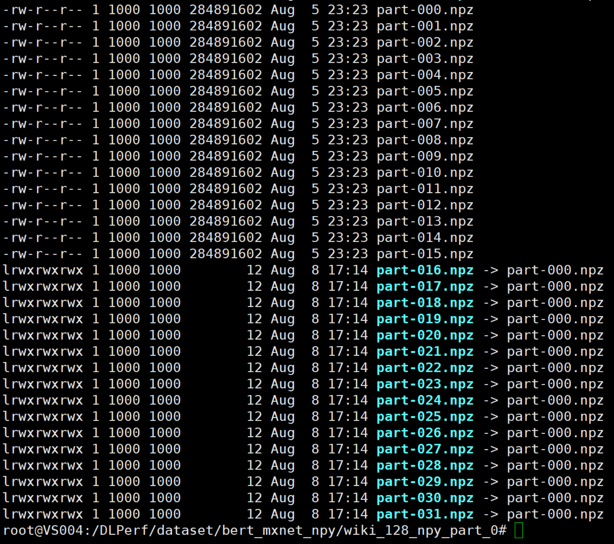
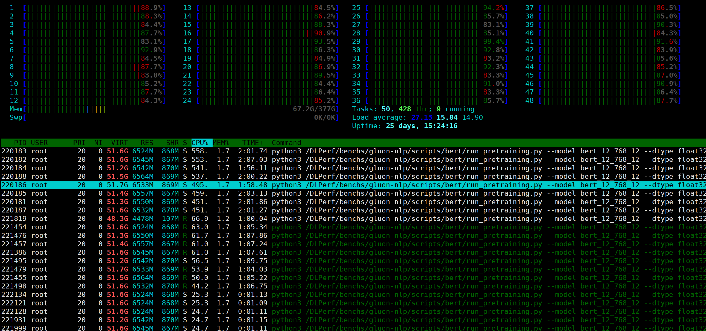

# MXNet BERT-Base 测评

## 概述 Overview

本测试基于 [gluon-nlp](https://github.com/dmlc/gluon-nlp) 仓库中提供的 MXNet框架的 [BERT-base](https://github.com/dmlc/gluon-nlp/tree/7b7bf60259e28b3bf1f4d70569a7e5c18e2f4b3e/scripts/bert) 实现，在 NVIDIA 官方提供的 [MXNet 20.03 NGC 镜像及其衍生容器](https://ngc.nvidia.com/catalog/containers/nvidia:mxnet/tags)中进行1机1卡、1机8卡、2机16卡、4机32卡的结果复现及速度评测，得到吞吐率及加速比，评判框架在分布式多机训练情况下的横向拓展能力。

目前，该测试仅覆盖 FP32 精度，后续将持续维护，增加混合精度训练，XLA 等多种方式的测评。


```shell
# --num_data_workers 8 \  
# 运行—启动5min   CPU占用 加载期：16核；训练期：16核跑满     内存：173G/377G   throughput=2.8K tks/s 
mpirun -oversubscribe -np ${gpu_num} -H ${node_ip} \
    -bind-to core -map-by slot \
    -x NCCL_DEBUG=INFO -x LD_LIBRARY_PATH -x PATH \
    -mca pml ob1 -mca btl ^openib \
    -mca plm_rsh_args "-p 22 -q -o StrictHostKeyChecking=no" \
    -mca btl_tcp_if_include ib0 \
python3 ${WORKSPACE}/run_pretraining.py ${CMD} 2>&1 | tee ${log_file}

# --num_data_workers 8 \  
# 运行—启动2min     CPU占用 加载期：48核；训练期：非固定16～24核，约16核跑满     内存：171G/377G   throughput=2.8K tks/s 
mpirun -oversubscribe -np ${gpu_num} -H ${node_ip} \
    -bind-to none -map-by slot \  #  -map-by numa也差不多一样
    -x NCCL_DEBUG=INFO -x LD_LIBRARY_PATH -x PATH \
    -mca pml ob1 -mca btl ^openib \
    -mca plm_rsh_args "-p 22 -q -o StrictHostKeyChecking=no" \
    -mca btl_tcp_if_include ib0 \
python3 ${WORKSPACE}/run_pretraining.py ${CMD} 2>&1 | tee ${log_file}

# --num_data_workers 8 \  
# 运行—启动5min     CPU占用 加载期：横向16核；训练期：16核跑满     内存：175G/377G   throughput=2.8K tks/s 
mpirun -oversubscribe -np ${gpu_num} -H ${node_ip} \
    -bind-to core -map-by socket \
    -x NCCL_DEBUG=INFO -x LD_LIBRARY_PATH -x PATH \
    -mca pml ob1 -mca btl ^openib \
    -mca plm_rsh_args "-p 22 -q -o StrictHostKeyChecking=no" \
    -mca btl_tcp_if_include ib0 \
python3 ${WORKSPACE}/run_pretraining.py ${CMD} 2>&1 | tee ${log_file}
```


## 环境 Environment

### 系统

- #### 硬件

  - GPU：8x Tesla V100-SXM2-16GB

- #### 软件

  - 驱动：NVIDIA 440.33.01
  
  - 系统：[ Ubuntu 16.04](http://releases.ubuntu.com/16.04/)
  
  - CUDA：10.2
  
  - cuDNN：7.6.5
  
  - NCCL：2.7.3
  
  - OpenMPI 4.0.0
  
  - Horovod 0.19.5
  
  - Python：3.7.7
  
- #### 框架
  
  - **MXNet 1.6.0** 

- #### Feature support matrix

  | Feature                         | BERT-Base MXNet |
| ------------------------------- | --------------- |
  | Horovod Multi-GPU               | Yes             |
| Horovod Multi-Node              | Yes             |
  | Automatic mixed precision (AMP) | No              |


## 快速开始 Quick Start

### 1. 前期准备

- #### 数据集

  数据集制作参考[gluon-nlp仓库提供的create_pretraining_data.py脚本](https://github.com/dmlc/gluon-nlp/blob/7b7bf60259e28b3bf1f4d70569a7e5c18e2f4b3e/scripts/bert/create_pretraining_data.py)

  

- #### SSH 免密

  单机测试下无需配置，但测试2机、4机等多机情况下，则需要配置节点间的ssh免密登录，保证MXNet 的 mpi 分布式脚本运行时可以在单机上与其他节点互联。

  **设置免密登录**

  - 节点间的 /root/.ssh/id_rsa.pub 互相授权，添加到 /root/.ssh/authorized_keys 中；
  - 修改 sshd 中用于 docker 通信的端口号 `vim /etc/ssh/sshd_config`，修改 `Port`；
  - 重启 ssh 服务，`service ssh restart`。
  
 - #### 环境安装
```shell
# 安装nccl
cd /usr/local && sudo wget ttps://oneflow-static.oss-cn-beijing.aliyuncs.com/package/nvidia/nccl/centos/nccl_2.7.3-1%2Bcuda10.2_x86_64.txz
sudo tar -xvf nccl_2.7.3-1+cuda10.2_x86_64.txz
# vim ~/.bashrc
export LD_LIBRARY_PATH=$LD_LIBRARY_PATH:/usr/local/nccl_2.7.3-1+cuda10.2_x86_64/lib

# 安装mxnet
python3 -m pip install gluonnlp==0.10.0 mxnet-cu102mkl==1.6.0.post0 -i https://mirror.baidu.com/pypi/simple
# 安装horovod（安装前，确保环境中已有nccl、openmpi）

HOROVOD_WITH_MXNET=1  HOROVOD_GPU_OPERATIONS=NCCL HOROVOD_GPU_ALLREDUCE=NCCL HOROVOD_GPU_BROADCAST=NCCL python3 -m pip install --no-cache-dir horovod==0.19.5
```


### 2. 额外准备

- #### 下载gluon-nlp仓库源码

  ```shell
  git clone https://github.com/dmlc/gluon-nlp.git 
  git checkout 7b7bf60259e28b3bf1f4d70569a7e5c18e2f4b3e
  ```

  注： 切换到这个分支才能跑，v0.9x分支不能跑，跑起来会卡住。(现象是GPU内存和计算都有被占用，同时可以看到有一个CPU线程被100%占用，但是发生了死锁）

- #### 注释参数

  - 注释掉 [`scripts/bert/data/pretrain.py`](https://github.com/dmlc/gluon-nlp/blob/7b7bf60259e28b3bf1f4d70569a7e5c18e2f4b3e/scripts/bert/data/pretrain.py#L65) 的round_to参数。

    原因是round_to参数会报错：

    ```shell
    <stderr>:TypeError: __init__() got an unexpected keyword argument 'round_to'
    ```

  - 注释掉 [`/scripts/bert/run_pretraining.py`](https://github.com/dmlc/gluon-nlp/blob/7b7bf60259e28b3bf1f4d70569a7e5c18e2f4b3e/scripts/bert/run_pretraining.py) 里跟eval_dir相关的逻辑:

    [line:95](https://github.com/dmlc/gluon-nlp/blob/7b7bf60259e28b3bf1f4d70569a7e5c18e2f4b3e/scripts/bert/run_pretraining.py#L95)  data_eval允许为空。

    ```
    parser.add_argument('--data_eval', type=str, required=False,
    ```

    [line:443](https://github.com/dmlc/gluon-nlp/blob/7b7bf60259e28b3bf1f4d70569a7e5c18e2f4b3e/scripts/bert/run_pretraining.py#L443)  不进行eval。

    ```python
    #    if data_eval:
    #        # eval data is always based on a fixed npz file.
    #        shuffle = False
    #        dataset_eval = get_pretrain_data_npz(data_eval, batch_size_eval,
    #                                             len(ctxs), shuffle, 1, vocab)
    #        evaluate(dataset_eval, model, ctxs, args.log_interval, args.dtype)
    ```

    原因是加上eval会卡住很久。

  - 训练200个iterations就结束：

    在 [`/scripts/bert/run_pretraining.py`](https://github.com/dmlc/gluon-nlp/blob/7b7bf60259e28b3bf1f4d70569a7e5c18e2f4b3e/scripts/bert/run_pretraining.py) 中添加结束标记，用于在train step达到后就终止训练

    [line:290](https://github.com/dmlc/gluon-nlp/blob/7b7bf60259e28b3bf1f4d70569a7e5c18e2f4b3e/scripts/bert/run_pretraining.py#L290)

    ```python
                 if step_num >= num_train_steps:
    +                end_of_batch = True
                     break
    ```

    

### 3. 运行测试

本次测试集群中有 4 台节点：

- NODE1=10.11.0.2
- NODE2=10.11.0.3
- NODE3=10.11.0.4
- NODE4=10.11.0.5

每个节点有 8 张 V100 显卡， 每张显卡显存 16 G。

- #### 测试

在容器内下载本仓库源码：

````shell
git clone https://github.com/Oneflow-Inc/DLPerf.git
````

将本仓库 `DLPerf/MXNet/BERT/` 路径源码放至 `gluon-nlp/scripts/bert/` 下，执行脚本

```shell
bash run_test.sh 
```

针对1机1卡、1机8卡、2机16卡、4机32卡， batch_size_per_device = **32**（注意：batch_size_per_device = 48及以上会导致显存OOM，故MXNet BERT-base 仅测试了batch size = 32和24的情况），进行测试，并将 log 信息保存在当前目录的`logs/mxnet/bert/bz32`对应分布式配置路径中。

### 4. 数据处理

测试进行了多组训练（本测试中取 7 次），每次训练过程只取第 1 个 epoch 的前 120 iter，计算训练速度时去掉前 20 iter，只取后 100 iter 的数据，以降低抖动。最后将 7 次训练的速度取中位数得到最终速度，并最终以此数据计算加速比。

运行，即可得到针对不同配置测试结果 log 数据处理的结果： 

```shell
python extract_mxnet_logs.py --log_dir=./logs/mxnet/bert/bz32 --batch_size_per_device=32
```

结果打印如下

```shell
./logs/mxnet/bert/bz32/4n8g/bert_base_b32_fp32_3.log {3: 1881.88}
./logs/mxnet/bert/bz32/4n8g/bert_base_b32_fp32_4.log {3: 1881.88, 4: 1985.75}
./logs/mxnet/bert/bz32/4n8g/bert_base_b32_fp32_6.log {3: 1881.88, 4: 1985.75, 6: 2092.25}
./logs/mxnet/bert/bz32/4n8g/bert_base_b32_fp32_1.log {3: 1881.88, 4: 1985.75, 6: 2092.25, 1: 1895.5}
./logs/mxnet/bert/bz32/4n8g/bert_base_b32_fp32_5.log {3: 1881.88, 4: 1985.75, 6: 2092.25, 1: 1895.5, 5: 1888.38}
./logs/mxnet/bert/bz32/4n8g/bert_base_b32_fp32_7.log {3: 1881.88, 4: 1985.75, 6: 2092.25, 1: 1895.5, 5: 1888.38, 7: 1902.62}
./logs/mxnet/bert/bz32/4n8g/bert_base_b32_fp32_2.log {3: 1881.88, 4: 1985.75, 6: 2092.25, 1: 1895.5, 5: 1888.38, 7: 1902.62, 2: 1697.88}
./logs/mxnet/bert/bz32/1n8g/bert_base_b32_fp32_3.log {3: 928.03}
./logs/mxnet/bert/bz32/1n8g/bert_base_b32_fp32_4.log {3: 928.03, 4: 929.69}
./logs/mxnet/bert/bz32/1n8g/bert_base_b32_fp32_6.log {3: 928.03, 4: 929.69, 6: 926.44}
./logs/mxnet/bert/bz32/1n8g/bert_base_b32_fp32_1.log {3: 928.03, 4: 929.69, 6: 926.44, 1: 932.47}
./logs/mxnet/bert/bz32/1n8g/bert_base_b32_fp32_5.log {3: 928.03, 4: 929.69, 6: 926.44, 1: 932.47, 5: 944.12}
./logs/mxnet/bert/bz32/1n8g/bert_base_b32_fp32_7.log {3: 928.03, 4: 929.69, 6: 926.44, 1: 932.47, 5: 944.12, 7: 926.88}
./logs/mxnet/bert/bz32/1n8g/bert_base_b32_fp32_2.log {3: 928.03, 4: 929.69, 6: 926.44, 1: 932.47, 5: 944.12, 7: 926.88, 2: 922.0}
./logs/mxnet/bert/bz32/1n1g/bert_base_b32_fp32_3.log {3: 125.48}
./logs/mxnet/bert/bz32/1n1g/bert_base_b32_fp32_4.log {3: 125.48, 4: 127.17}
./logs/mxnet/bert/bz32/1n1g/bert_base_b32_fp32_6.log {3: 125.48, 4: 127.17, 6: 127.73}
./logs/mxnet/bert/bz32/1n1g/bert_base_b32_fp32_1.log {3: 125.48, 4: 127.17, 6: 127.73, 1: 126.29}
./logs/mxnet/bert/bz32/1n1g/bert_base_b32_fp32_5.log {3: 125.48, 4: 127.17, 6: 127.73, 1: 126.29, 5: 127.09}
./logs/mxnet/bert/bz32/1n1g/bert_base_b32_fp32_7.log {3: 125.48, 4: 127.17, 6: 127.73, 1: 126.29, 5: 127.09, 7: 127.05}
./logs/mxnet/bert/bz32/1n1g/bert_base_b32_fp32_2.log {3: 125.48, 4: 127.17, 6: 127.73, 1: 126.29, 5: 127.09, 7: 127.05, 2: 126.4}
./logs/mxnet/bert/bz32/2n8g/bert_base_b32_fp32_3.log {3: 1171.19}
./logs/mxnet/bert/bz32/2n8g/bert_base_b32_fp32_4.log {3: 1171.19, 4: 1107.62}
./logs/mxnet/bert/bz32/2n8g/bert_base_b32_fp32_6.log {3: 1171.19, 4: 1107.62, 6: 1152.5}
./logs/mxnet/bert/bz32/2n8g/bert_base_b32_fp32_1.log {3: 1171.19, 4: 1107.62, 6: 1152.5, 1: 1159.12}
./logs/mxnet/bert/bz32/2n8g/bert_base_b32_fp32_5.log {3: 1171.19, 4: 1107.62, 6: 1152.5, 1: 1159.12, 5: 1136.44}
./logs/mxnet/bert/bz32/2n8g/bert_base_b32_fp32_7.log {3: 1171.19, 4: 1107.62, 6: 1152.5, 1: 1159.12, 5: 1136.44, 7: 1090.31}
./logs/mxnet/bert/bz32/2n8g/bert_base_b32_fp32_2.log {3: 1171.19, 4: 1107.62, 6: 1152.5, 1: 1159.12, 5: 1136.44, 7: 1090.31, 2: 1033.88}
{'bert-base': {'1n1g': {'average_speed': 126.74,
                        'batch_size_per_device': 32,
                        'median_speed': 127.05,
                        'speedup': 1.0},
               '1n8g': {'average_speed': 929.95,
                        'batch_size_per_device': 32,
                        'median_speed': 928.03,
                        'speedup': 7.3},
               '2n8g': {'average_speed': 1121.58,
                        'batch_size_per_device': 32,
                        'median_speed': 1136.44,
                        'speedup': 8.94},
               '4n8g': {'average_speed': 1906.32,
                        'batch_size_per_device': 32,
                        'median_speed': 1895.5,
                        'speedup': 14.92}}}
Saving result to ./result/bz32_result.json
```


### 5. 计算规则

#### 5.1 测速脚本

- extract_mxnet_logs.py 根据官方在log中打印的速度，在120个iter中，排除前20iter，取后100个iter的速度做平均；


#### 5.2 均值速度和中值速度

- average_speed均值速度

- median_speed中值速度

  每个batch size进行5~7次训练测试，记为一组，每一组取average_speed为均值速度，median_speed为中值速度

#### 5.3 加速比以中值速度计算

脚本和表格中的 **加速比** 是以单机单卡下的中值速度为基准进行计算的。例如:

单机单卡情况下速度为200(samples/s)，单机2卡速度为400，单机4卡速度为700，则加速比分别为：1.0、2.0、3.5


## 性能结果 Performance

该小节提供针对 MXNet 框架的BERT-base 模型单机测试的性能结果和完整 log 日志。

### FP32 & W/O XLA

- ### BERT-base batch_size = 32

| node_num | gpu_num | samples/s | speedup |
| -------- | ------- | --------- | ------- |
| 1        | 1       | 127.05    | 1.00    |
| 1        | 8       | 928.03    | 7.3     |
| 2        | 16      | 1136.44   | 8.94    |
| 4        | 32      | 1895.50   | 14.92   |


- ### BERT-base batch_size = 24

| node_num | gpu_num | samples/s | speedup |
| -------- | ------- | --------- | ------- |
| 1        | 1       | 119.72    | 1.00    |
| 1        | 8       | 857.28    | 7.13    |
| 2        | 16      | 875.69    | 7.29    |
| 4        | 32      | 1505.12   | 12.52   |


详细 Log 信息可下载：[mxnet_bert_base_logs.zip](https://oneflow-public.oss-cn-beijing.aliyuncs.com/DLPerf/logs/MxNet/bert/logs.zip)


## MXNet BERT-base 多机加速比很低的问题

在测试MXNet BERT-base的多机过程中，发现性能表现不够理想，跟NVIDIA DeepLearningExample中的Resnet50多机性能表现相比差距巨大。我们尝试了多次，通过增删参数、设置环境变量、打印log等方式，排除了NCCL、RDMA等通信速度的问题，发现性能瓶颈不是网络传输和多卡同步的开销，而是CPU全部被占满了（48个线程都是几乎100%占用），导致没有能力供应多机多卡的计算。

### 测试环境

我们所有的测试都是在4台配置8卡V100-SXM2-16GB的服务器中进行，主要硬软件配置如下：

- Tesla V100-SXM2-16GB x 8
- InfiniBand 100 Gb/sec (4X EDR)， Mellanox Technologies MT27700 Family
- Intel(R) Xeon(R) Gold 5118 CPU @ 2.30GHz
- Memory 384G
- Ubuntu 16.04.4 LTS (GNU/Linux 4.4.0-116-generic x86_64)
- CUDA Version: 10.2, Driver Version: 440.33.01
- `nvidia-smi topo -m`

```
        GPU0    GPU1    GPU2    GPU3    GPU4    GPU5    GPU6    GPU7    mlx5_0  CPU Affinity
GPU0     X      NV1     NV1     NV2     NV2     SYS     SYS     SYS     NODE    0-11,24-35
GPU1    NV1      X      NV2     NV1     SYS     NV2     SYS     SYS     NODE    0-11,24-35
GPU2    NV1     NV2      X      NV2     SYS     SYS     NV1     SYS     PIX     0-11,24-35
GPU3    NV2     NV1     NV2      X      SYS     SYS     SYS     NV1     PIX     0-11,24-35
GPU4    NV2     SYS     SYS     SYS      X      NV1     NV1     NV2     SYS     12-23,36-47
GPU5    SYS     NV2     SYS     SYS     NV1      X      NV2     NV1     SYS     12-23,36-47
GPU6    SYS     SYS     NV1     SYS     NV1     NV2      X      NV2     SYS     12-23,36-47
GPU7    SYS     SYS     SYS     NV1     NV2     NV1     NV2      X      SYS     12-23,36-47
mlx5_0  NODE    NODE    PIX     PIX     SYS     SYS     SYS     SYS      X

Legend:

  X    = Self
  SYS  = Connection traversing PCIe as well as the SMP interconnect between NUMA nodes (e.g., QPI/UPI)
  NODE = Connection traversing PCIe as well as the interconnect between PCIe Host Bridges within a NUMA node
  PHB  = Connection traversing PCIe as well as a PCIe Host Bridge (typically the CPU)
  PXB  = Connection traversing multiple PCIe bridges (without traversing the PCIe Host Bridge)
  PIX  = Connection traversing at most a single PCIe bridge
  NV#  = Connection traversing a bonded set of # NVLinks

```

### 测试容器

测试容器使用的是[NGC 20.03 mxnet](https://ngc.nvidia.com/catalog/containers/nvidia:mxnet/tags)容器，容器信息介绍见[此处](https://docs.nvidia.com/deeplearning/frameworks/mxnet-release-notes/rel_20-03.html#rel_20-03)，与NVIDIA DeepLearningExample里的MXNet ResNet50v1.5 测试环境一样。使用MXNet版本为[1.6.0](https://github.com/apache/incubator-mxnet/releases/tag/1.6.0)。

### 模型库

模型库使用的是[gluon-nlp](https://github.com/dmlc/gluon-nlp/tree/7b7bf60259e28b3bf1f4d70569a7e5c18e2f4b3e)仓库的BERT脚本[run_pretraining.py](https://github.com/dmlc/gluon-nlp/blob/7b7bf60259e28b3bf1f4d70569a7e5c18e2f4b3e/scripts/bert/run_pretraining.py)

### 现象1： 数据集part大小严重影响训练的启动时间

我们使用了32个part的数据集文件，格式为npz，每个文件大小为280M（相比之下OneFlow Benchmark中的数据集每个part大小为2G多）。当part数量为32时，单机8卡、2机16卡的启动时间会很久（将近十分钟），同时可以观测到在训练时CPU的48个物理线程均被占满。在单机8卡的训练中，内存占用超过300G。当把part数量降至8以后，启动速度变快很多。但是对训练速度无增益，仍然不够理想。

数据集：



内存300G：


### 现象2：配置参数和环境变量无法降低训练时的CPU占用率，无法提升分布式训练速度

gluon-nlp的BERT训练参数有一项跟加载数据集的线程数相关，为[`--num_data_workers`](https://github.com/dmlc/gluon-nlp/blob/7b7bf60259e28b3bf1f4d70569a7e5c18e2f4b3e/scripts/bert/run_pretraining.py#L131)

```python
parser.add_argument('--num_data_workers', type=int, default=8,
                    help='Number of workers to pre-process data.')
```

在单机8卡、2机16卡的测试中，尝试设置`--num_data_workers=1,8,48` ，均不能影响训练时的CPU占用率。

根据MXNet的官方issue [Why CPU load is so heavy during training? How can I reduce it](https://discuss.mxnet.io/t/why-cpu-load-is-so-heavy-during-training-how-can-i-reduce-it/2735/5) 中的介绍:

```
I managed to find a method to solve this problem by mannually set the environment variable ‘OMP_NUM_THREAD’ = 4 * num_GPU_used. The number of threads can be reduced by about 90 and everything works well. Maybe this variable is related to the data loading process since I find I cannot set it’s value to a too small one. It’s still a little strange that I thought this variable is only related to the performance when we use CPU to do training.

Thanks for your patience and nice answers. They help me a lot to find the final solution!
```

尝试设置环境变量 `export OMP_NUM_THREAD = 1, 8, 32` 等，也不能影响训练时的CPU占用率。

训练时的CPU占用率表现为：



### 求助

经过长时间的debug，仍然不能解决MXNet的BERT-Base的多机性能问题。我们怀疑有可能是gluon-nlp仓库的脚本问题，比如读取数据集的脚本[pretraining_utils.py](https://github.com/dmlc/gluon-nlp/blob/7b7bf60259e28b3bf1f4d70569a7e5c18e2f4b3e/scripts/bert/pretraining_utils.py#L193)，或者是其定义的[nlp.utils.Parallel](https://github.com/dmlc/gluon-nlp/blob/7b7bf60259e28b3bf1f4d70569a7e5c18e2f4b3e/scripts/bert/run_pretraining.py#L281)调用了过多的CPU资源，导致了性能瓶颈，又或者是MXNet框架内部在训练时需要过多的CPU资源？不知道是否有了解相关内容的小伙伴可以复现一下我们的实验，或者帮助我们解决这个性能测试的问题。

