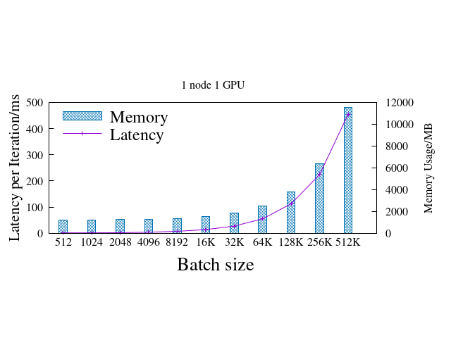
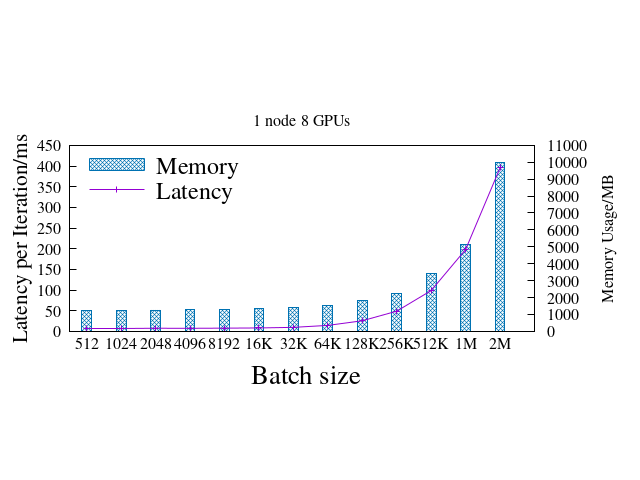
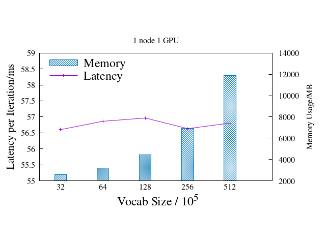
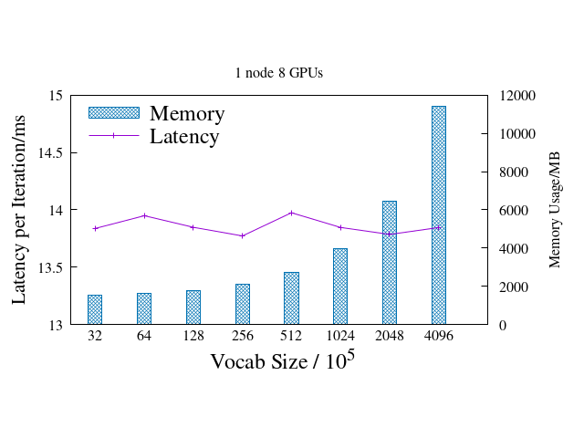
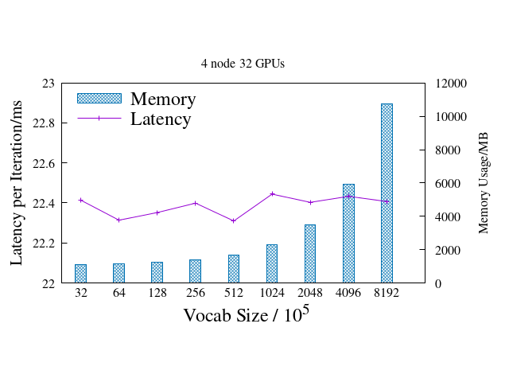
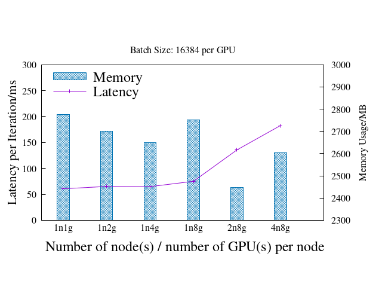
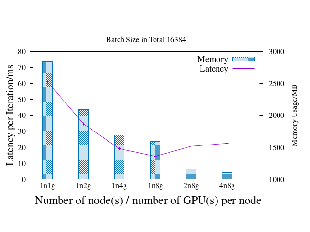

# DLPerf OneFlow WideDeepLearning Evaluation
This folder holds OneFlow WideDeepLearning Benchmark Test scripts, tools and reports.

## Folder Structure
```
├── docker
│   ├── build.sh
│   ├── launch.sh
│   └── ubuntu.dockerfile
├── imgs
├── extract_info_from_log.py # extract information form log files
├── extract_time.py 
├── gpu_memory_usage.py # log maximum GPU device memory usage during testing
├── README.md
└── scripts
    ├── 300k_iters.sh # 300k iterations test, display loss and auc every 1000 iterations.
    ├── 500_iters.sh # 500 iterations test, display loss and auc every iteration.
    ├── bsz_x2.sh # Batch Size Double Test
    ├── fix_bsz.sh # test with different number of devices and fixing batch size per device
    ├── local_launch_in_docker.sh # launch oneflow-wdl in docker with arguments
    ├── train_all_in_docker.sh # multi-nodes training scripts
    └── vocab_x2.sh # Vocabulary Size Double Test
```

## Benchmark Test Cases
This report summarized OneFlow test on 4 nodes with 8 x Tesla V100 on Oct 2020.

### Test Environment

- Tesla V100-SXM2-16GB x 8
- InfiniBand 100 Gb/sec (4X EDR)， Mellanox Technologies MT27700 Family
- Intel(R) Xeon(R) Gold 5118 CPU @ 2.30GHz
- Memory 384G
- Ubuntu 16.04.4 LTS (GNU/Linux 4.4.0-116-generic x86_64)
- CUDA Version: 10.2, Driver Version: 440.33.01
- OneFlow: v0.2.0-83-gb16a8d42f 
- OneFlow-Benchmark: update_wdl@42c5515
- `nvidia-smi topo -m`

```
        GPU0    GPU1    GPU2    GPU3    GPU4    GPU5    GPU6    GPU7    mlx5_0  CPU Affinity
GPU0     X      NV1     NV1     NV2     NV2     SYS     SYS     SYS     NODE    0-11,24-35
GPU1    NV1      X      NV2     NV1     SYS     NV2     SYS     SYS     NODE    0-11,24-35
GPU2    NV1     NV2      X      NV2     SYS     SYS     NV1     SYS     PIX     0-11,24-35
GPU3    NV2     NV1     NV2      X      SYS     SYS     SYS     NV1     PIX     0-11,24-35
GPU4    NV2     SYS     SYS     SYS      X      NV1     NV1     NV2     SYS     12-23,36-47
GPU5    SYS     NV2     SYS     SYS     NV1      X      NV2     NV1     SYS     12-23,36-47
GPU6    SYS     SYS     NV1     SYS     NV1     NV2      X      NV2     SYS     12-23,36-47
GPU7    SYS     SYS     SYS     NV1     NV2     NV1     NV2      X      SYS     12-23,36-47
mlx5_0  NODE    NODE    PIX     PIX     SYS     SYS     SYS     SYS      X

Legend:

  X    = Self
  SYS  = Connection traversing PCIe as well as the SMP interconnect between NUMA nodes (e.g., QPI/UPI)
  NODE = Connection traversing PCIe as well as the interconnect between PCIe Host Bridges within a NUMA node
  PHB  = Connection traversing PCIe as well as a PCIe Host Bridge (typically the CPU)
  PXB  = Connection traversing multiple PCIe bridges (without traversing the PCIe Host Bridge)
  PIX  = Connection traversing at most a single PCIe bridge
  NV#  = Connection traversing a bonded set of # NVLinks

```

### 500 Iterations Test
This test aims to show the training loss convergency profile and validation area under the ROC Curve(AUC) during 500 steps testing. 

To show the tendency of the loss and AUC curves clearly, the total training batch size is set to 512, 512 is a small value compared to the WDL industry production scenario. Validation should be performed every training step.

### 300,000 Iterations Test
This test aims to show the training loss profile and validation area under the ROC Curve(AUC) during 300,000 steps testing. Compare to 500 iters test, we print loss and AUC every 1000 steps, it will bring us a long period view of loss and AUC curves.

### Fixed Total Batch Size Test
This test will keep the total batch size as a constant value(default is 16384), each test case adopts a different number of GPU devices, such as 1, 2, 4, 8, 16, 32.

Latency and GPU device memory usage should be recorded in this test.

### Fixed Batch Size per Device Test
This test will keep batch size per device as a constant value(default is 16384), each test case adopts a different number of GPU devices, such as 1, 2, 4, 8, 16, 32, the total batch size is scaled up with the total number of devices of the test case.

Latency and GPU device memory usage should be recorded in this test.

### Batch Size Double Test
This test uses one GPU device, the first case's batch size is 512, the batch size of the subsequent case is doubled, and so on. This test can be performed on single device, single node and multi-nodes.

Latency and GPU device memory usage should be recorded in this test.

### Vocabulary Size Double Test
This test uses devices as much as possible, the first case's vocabulary size is 3,200,000, the vocab size of the subsequent case is doubled, and so on. This test can be performed on single device, single node and multi-nodes.

Latency and GPU device memory usage should be recorded in this test.


## Test Results
Each group was tested three times, and the median of data was selected as the final result.

All the logs can be obtained [here](https://oneflow-public.oss-cn-beijing.aliyuncs.com/DLPerf/logs/OneFlow/oneflow_wdl_1025_logs.tgz).

### batch size X 2 tests
#### 1 node 1 device  
|gpu|batch_size|deep_vocab_size|deep_embedding_vec_size|hidden_units_num|latency(ms)|memory_usage(MB)|
|----|----|----|----|----|----|----|
|n1g1|512|2322444|16|2|1.663|1,225|
|n1g1|1024|2322444|16|2|1.815|1,237|
|n1g1|2048|2322444|16|2|2.401|1,255|
|n1g1|4096|2322444|16|2|4.315|1,295|
|n1g1|8192|2322444|16|2|7.616|1,377|
|n1g1|16384|2322444|16|2|14.271|1,539|
|n1g1|32768|2322444|16|2|27.488|1,859|
|n1g1|65536|2322444|16|2|55.472|2,507|
|n1g1|131072|2322444|16|2|112.809|3,801|
|n1g1|262144|2322444|16|2|224.603|6,393|
|n1g1|524288|2322444|16|2|455.137|11,569|



#### 1 node 8 devices
|gpu|batch_size|deep_vocab_size|deep_embedding_vec_size|hidden_units_num|latency(ms)|memory_usage(MB)|
|----|----|----|----|----|----|----|
|n1g8|512|2322444|16|2|7.937|1,255|
|n1g8|1024|2322444|16|2|7.948|1,259|
|n1g8|2048|2322444|16|2|7.449|1,263|
|n1g8|4096|2322444|16|2|7.391|1,271|
|n1g8|8192|2322444|16|2|7.702|1,283|
|n1g8|16384|2322444|16|2|8.247|1,321|
|n1g8|32768|2322444|16|2|9.733|1,393|
|n1g8|65536|2322444|16|2|14.339|1,529|
|n1g8|131072|2322444|16|2|25.634|1,799|
|n1g8|262144|2322444|16|2|48.848|2,217|
|n1g8|524288|2322444|16|2|98.652|3,439|
|n1g8|1048576|2322444|16|2|197.899|5,117|
|n1g8|2097152|2322444|16|2|395.698|10,007|



#### 4 nodes 32 devices
|gpu|batch_size|deep_vocab_size|deep_embedding_vec_size|hidden_units_num|latency(ms)|memory_usage(MB)|
|----|----|----|----|----|----|----|
|n4g8|16384|2322444|32|2|14.069|979|
|n4g8|32768|2322444|32|2|18.149|1,021|
|n4g8|65536|2322444|32|2|26.173|1,097|
|n4g8|131072|2322444|32|2|42.573|1,241|
|n4g8|262144|2322444|32|2|78.730|1,527|
|n4g8|524288|2322444|32|2|138.211|2,111|
|n4g8|1048576|2322444|32|2|250.525|3,283|
|n4g8|2097152|2322444|32|2|485.079|5,617|
|n4g8|4194304|2322444|32|2|955.242|10,291|


### vocab size X 2 tests
#### 1 node 1 device  
|gpu|batch_size|deep_vocab_size|deep_embedding_vec_size|hidden_units_num|latency(ms)|memory_usage(MB)|
|----|----|----|----|----|----|----|
|n1g1|16384|3200000|16|7|56.601|2,557|
|n1g1|16384|6400000|16|7|56.862|3,179|
|n1g1|16384|12800000|16|7|56.964|4,421|
|n1g1|16384|25600000|16|7|56.841|6,913|
|n1g1|16384|51200000|16|7|56.805|11,891|



#### 1 node 8 devices
|gpu|batch_size|deep_vocab_size|deep_embedding_vec_size|hidden_units_num|latency(ms)|memory_usage(MB)|
|----|----|----|----|----|----|----|
|n1g8|16384|3200000|16|7|13.837|1,533|
|n1g8|16384|6400000|16|7|13.948|1,613|
|n1g8|16384|12800000|16|7|13.847|1,775|
|n1g8|16384|25600000|16|7|13.772|2,087|
|n1g8|16384|51200000|16|7|13.974|2,713|
|n1g8|16384|102400000|16|7|13.846|3,945|
|n1g8|16384|204800000|16|7|13.785|6,435|
|n1g8|16384|409600000|16|7|13.845|11,423|



#### 4 nodes 32 devices
|gpu|batch_size|deep_vocab_size|deep_embedding_vec_size|hidden_units_num|latency(ms)|memory_usage(MB)|
|----|----|----|----|----|----|----|
|n4g8|16384|3200000|32|7|22.414|1,115|
|n4g8|16384|6400000|32|7|22.314|1,153|
|n4g8|16384|12800000|32|7|22.352|1,227|
|n4g8|16384|25600000|32|7|22.399|1,379|
|n4g8|16384|51200000|32|7|22.310|1,685|
|n4g8|16384|102400000|32|7|22.444|2,293|
|n4g8|16384|204800000|32|7|22.403|3,499|
|n4g8|16384|409600000|32|7|22.433|5,915|
|n4g8|16384|819200000|32|7|22.407|10,745|



### fixed batch size per device tests
|gpu|batch_size|deep_vocab_size|deep_embedding_vec_size|hidden_units_num|latency(ms)|memory_usage(MB)|
|----|----|----|----|----|----|----|
|n1g1|16384|2322444|32|7|60.802|2,777|
|n1g2|32768|2322444|32|7|65.332|2,701|
|n1g4|65536|2322444|32|7|64.950|2,649|
|n1g8|131072|2322444|32|7|75.222|2,751|
|n2g8|262144|2322444|32|7|135.789|2,449|
|n4g8|524288|2322444|32|7|182.648|2,605|



### fixed total batch size tests
|gpu|batch_size|deep_vocab_size|deep_embedding_vec_size|hidden_units_num|latency(ms)|memory_usage(MB)|
|----|----|----|----|----|----|----|
|n1g1|16384|2322444|32|7|60.674|2,839|
|n1g2|16384|2322444|32|7|34.588|2,087|
|n1g4|16384|2322444|32|7|19.029|1,689|
|n1g8|16384|2322444|32|7|14.281|1,591|
|n2g8|16384|2322444|32|7|20.544|1,157|
|n4g8|16384|2322444|32|7|22.420|1,105|


