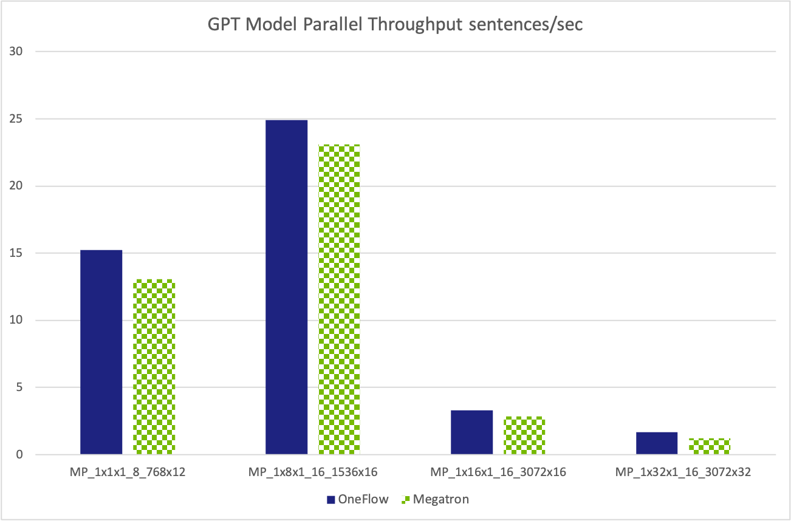
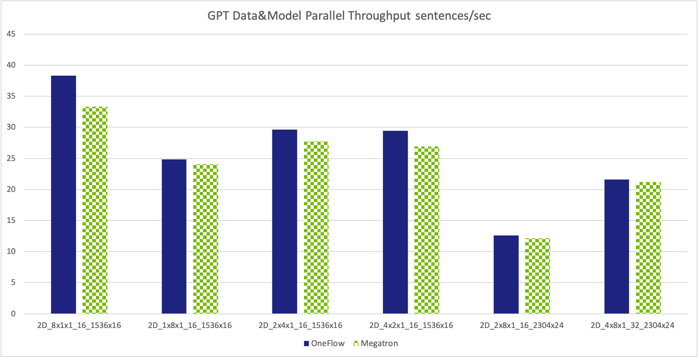
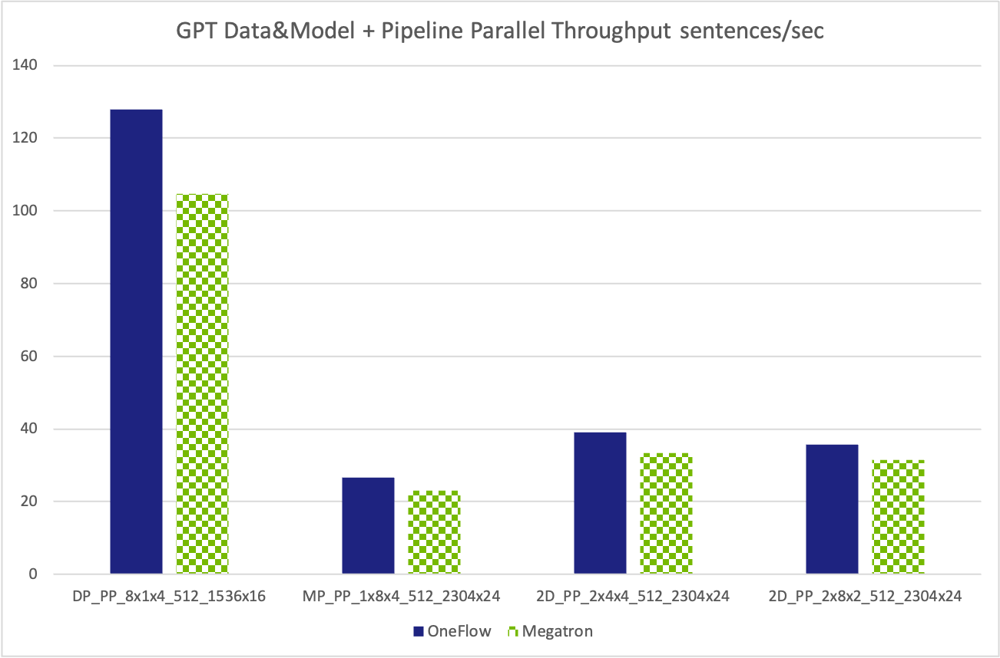

# DLPerf GPT Benchmark Test Report

## Introduction
Generative Pre-trained Transformer (GPT) is an autoregressive language model that uses deep learning to produce human-like text created by [OpenAI](https://openai.com/). [Megatron-LM](https://github.com/NVIDIA/Megatron-LM) is a large, powerful transformer developed by the Applied Deep Learning Research team at NVIDIA, It is an ongoing project which is developed based on PyTorch, aiming to achieve efficient, model-parallel (tensor and pipeline), and multi-node pre-training of GPT and BERT using mixed precision.

With SBP (Split, Broadcast, and Partial-value) abstraction, OneFlow supports hybrid of data parallelism and tensor model parallelism easily without extra customized plugins, and naturally supports pipeline parallelism based on the decentralized actor abstraction. [OneFlow-GPT](https://github.com/Oneflow-Inc/OneFlow-Benchmark/tree/master/LanguageModeling/GPT) scripts in OneFlow-Benchmark repository is the implementation of GPT based on OneFlow.

We compare the performance of both Megatron-LM GPT and OneFlow-GPT in representative configurations under the same hardware conditions. This report is the summary of the other two reports:
- [OneFlow GPT Benchmark Test Report](https://github.com/Oneflow-Inc/DLPerf/OneFlow/LanguageModeling/GPT/reports/oneflow_gpt_report_0512.md)
- [NVIDIA/Megatron-LM Benchmark](https://github.com/Oneflow-Inc/DLPerf/Megatron-LM)

## Test Environment
All tests were performed on 4 Nodes with 8x Tesla V100-SXM2-16GB GPUs.

## Test Options
In order to compare the performance under the same hardware conditions, a series of tests are designed in this report. The test measurements is throughputs(sequences/sentenses per second), higer throughputs means better performance.

4 Groups of test were performed, they are:
- data parallelism test
- tensor model parallelism test
- hybrid parallelism with both data parallelism and tensor model parallelism test
- pipeline model parallelism test

GPT model parameters such as hidden-size, number of layers are varied for each test case. All models use a vocabulary size of 51,200 and a sequence length of 2048.

### Test case Naming Rules

All test case are named starting with a prefix:
- `DP` stands for Data Parallelism Test
- `MP` stands for Tensor Model Parallelism Test
- `2D` stands for Data Parallelism and Tensor Model Parallelism Test
- `PP` stands for Pipeline Model Parallelism Test

Following string (e.g. `4x8x1`) is the parallel configration for data parallel size (`4`), tensor model parallel size(`8`), and number of pipeline stages(`1`).

Last part is the GPT model parameters: `hidden-size` x `number-of-layers`.

Global batch size is between parallel size and GPT model parameters.

## Test Results

### Data Parallelism Test
Test Case | OneFlow   sequences/sec | Megatron-LM   sequences/sec
-- | -- | --
DP_1x1x1_2_1536x16 | 4.92 | 4.31
DP_8x1x1_16_1536x16 | 38.28 | 33.27
DP_16x1x1_32_1536x16 | 65.35 | 48.16
DP_32x1x1_64_1536x16 | 123.40 | 93.63

### Tensor Model Parallelism Test
Test Case | OneFlow   sequences/sec | Megatron-LM   sequences/sec
-- | -- | --
MP_1x1x1_8_768x12 | 15.23 | 13.09
MP_1x8x1_16_1536x16 | 24.92 | 23.11
MP_1x16x1_16_3072x16 | 3.32 | 2.85
MP_1x32x1_16_3072x32 | 1.68 | 1.23

### Data Parallelism and Tensor Model Parallelism Test
Test Case | OneFlow   sequences/sec | Megatron-LM   sequences/sec
-- | -- | --
2D_8x1x1_16_1536x16 | 38.29 | 33.32
2D_1x8x1_16_1536x16 | 24.83 | 24.07
2D_2x4x1_16_1536x16 | 29.65 | 27.75
2D_4x2x1_16_1536x16 | 29.42 | 26.95
2D_2x8x1_16_2304x24 | 12.61 | 12.18
2D_4x8x1_32_2304x24 | 21.62 | 21.21

### Pipeline Model Parallelism Test
Test Case | OneFlow   sequences/sec | Megatron-LM   sequences/sec
-- | -- | --
DP_PP_8x1x4_512_1536x16 | 127.80 | 104.63
MP_PP_1x8x4_512_2304x24 | 26.67 | 23.10
2D_PP_2x4x4_512_2304x24 | 39.03 | 33.40
2D_PP_2x8x2_512_2304x24 | 35.62 | 31.45

