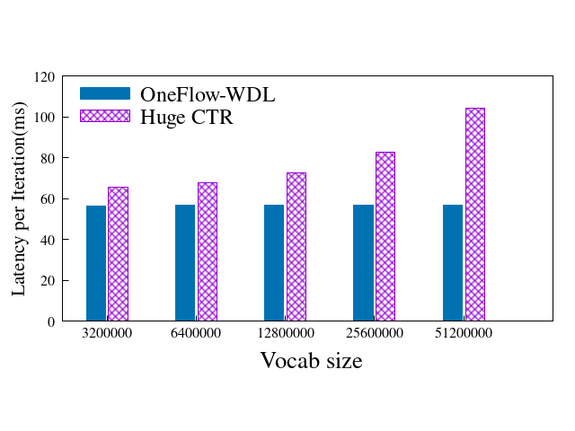
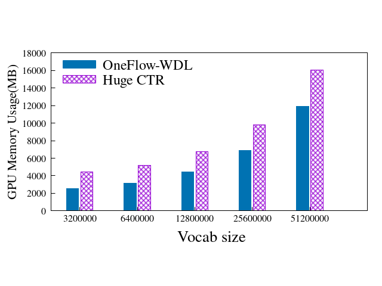
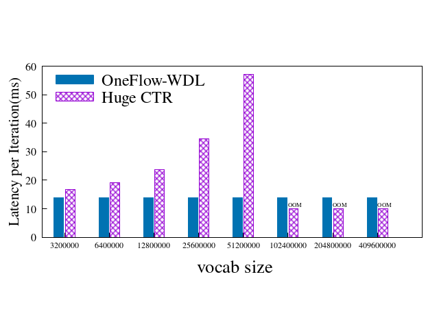
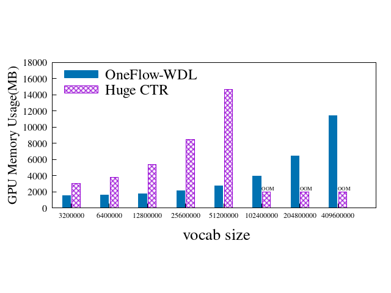
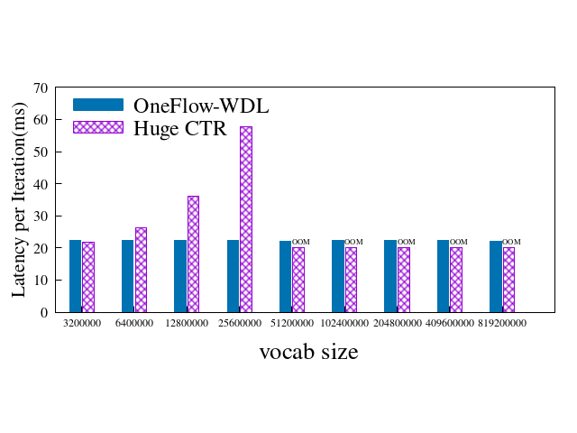
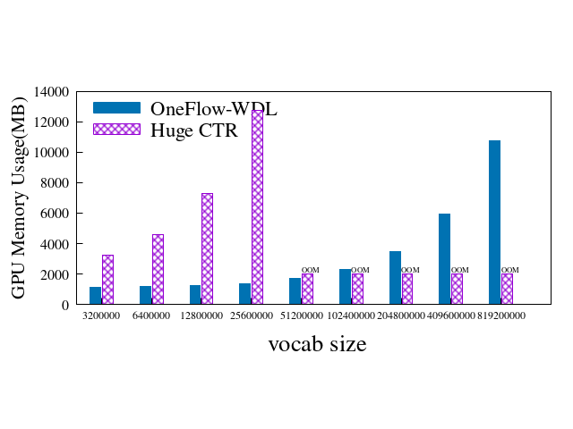

# DLPerf Wide & Deep Test Report V1.0

## Introduction
Wide & Deep is a very important model of the CTR(Click Through Rate) field, which is widely used in recommendation system. The model of Wide & Deep is very large, meanwhile, has to deal with huge data throughput. Therefore, Wide & Deep has high requirements for deep learning framework. For a long time, the Wide & Deep model implemented by [HugeCTR](https://github.com/NVIDIA/HugeCTR) has the best performace.


A series of tests are designed in this report aims to compare the performance and limit of the frameworks through multiple factors with the same hardware conditions. The factors include: vocabulary size, batch size, number of GPUS, etc. The test measurements are latency per iteration and memory usage. In short, smaller latency means better performance and smaller memory usage means better memory management capability which means the model can support a larger `vocab_size` and `batch_size` under the same hardware conditions.

## Test Environment

All tests were performed on 4 Nodes with 8x Tesla V100-SXM2-16GB GPUs, the following is the main hardware and software configuration for each:  

- 4 nodes with Tesla V100-SXM2-16GB x 8 each
- InfiniBand 100 Gb/sec (4X EDR)， Mellanox Technologies MT27700 Family
- Intel(R) Xeon(R) Gold 5118 CPU @ 2.30GHz
- Memory 384G
- Ubuntu 16.04.4 LTS (GNU/Linux 4.4.0-116-generic x86_64)
- CUDA Version: 10.2, Driver Version: 440.33.01
- OneFlow: v0.2.0-83-gb16a8d42f 
- OneFlow-Benchmark: update_wdl@42c5515
- HugeCTR version: 2.2
- `nvidia-smi topo -m`

```
        GPU0    GPU1    GPU2    GPU3    GPU4    GPU5    GPU6    GPU7    mlx5_0  CPU Affinity
GPU0     X      NV1     NV1     NV2     NV2     SYS     SYS     SYS     NODE    0-11,24-35
GPU1    NV1      X      NV2     NV1     SYS     NV2     SYS     SYS     NODE    0-11,24-35
GPU2    NV1     NV2      X      NV2     SYS     SYS     NV1     SYS     PIX     0-11,24-35
GPU3    NV2     NV1     NV2      X      SYS     SYS     SYS     NV1     PIX     0-11,24-35
GPU4    NV2     SYS     SYS     SYS      X      NV1     NV1     NV2     SYS     12-23,36-47
GPU5    SYS     NV2     SYS     SYS     NV1      X      NV2     NV1     SYS     12-23,36-47
GPU6    SYS     SYS     NV1     SYS     NV1     NV2      X      NV2     SYS     12-23,36-47
GPU7    SYS     SYS     SYS     NV1     NV2     NV1     NV2      X      SYS     12-23,36-47
mlx5_0  NODE    NODE    PIX     PIX     SYS     SYS     SYS     SYS      X

Legend:

  X    = Self
  SYS  = Connection traversing PCIe as well as the SMP interconnect between NUMA nodes (e.g., QPI/UPI)
  NODE = Connection traversing PCIe as well as the interconnect between PCIe Host Bridges within a NUMA node
  PHB  = Connection traversing PCIe as well as a PCIe Host Bridge (typically the CPU)
  PXB  = Connection traversing multiple PCIe bridges (without traversing the PCIe Host Bridge)
  PIX  = Connection traversing at most a single PCIe bridge
  NV#  = Connection traversing a bonded set of # NVLinks

```


## Framework & Models

| Framework | Version | Docker From |Model Sources|
| --------- | ------- | ----------- | ----------- |
|[OneFlow](https://github.com/Oneflow-Inc/oneflow/tree/v0.2.0)|0.2.0|             |[OneFolow-Benchmark](https://github.com/Oneflow-Inc/OneFlow-Benchmark/tree/v0.2.0/ClickThroughRate/WideDeepLearning)|
|[HugeCTR](https://github.com/NVIDIA/HugeCTR)| 2.2 ||[samples/wdl](https://github.com/NVIDIA/HugeCTR/tree/v2.2/samples/wdl)|

## Test Options

### Vocab Size X2 Tests
Keep doubling vocab size until out of memory.

- Devices Config: 1 node 1 device, 1 node 8 devices, 4 nodes 32 devices
- Batch Size: 16384
- deep_embedding_vec_size: 32 on 4 nodes 32 devices, 16 on other test cases
- hidden unit: 7

### Batch Size X2 Tests

Keep doubling batch size until out of memory.

- Devices Config: 1 node 1 device, 1 node 8 devices, 4 nodes 32 devices
- Deep Vocab Size: 2322444
- deep_embedding_vec_size: 32 on 4 nodes 32 devices, 16 on other test cases
- hidden unit: 7

### Fixed Batch Size in Total Tests

Test under the situation of different number of nodes and devices with fixed batch size in total.

- Devices Config: 1 node 1 device, 1 node 8 devices, 2 nodes 16 devices, 4 nodes 32 devices
- Batch Size: 16384
- Vocab Size: 2322444
- deep_embedding_vec_size: 32
- hidden unit: 7

### Fixed Batch Size per GPU Device Tests

Test under the situation of different number of nodes and devices with fixed batch size per GPU device.

- Devices Config: 1 node 1 device, 1 node 8 devices, 2 nodes 16 devices, 4 nodes 32 devices
- Batch Size per GPU device: 16384
- Vocab Size: 2322444
- deep_embedding_vec_size: 32
- hidden unit: 7

## Test Results
The following is a summary of the **Vocab Size X2 Tests**. Other types testing results, including **Batch Size X2 Tests**, **Fixed Batch Size Tests**. Please refer to [OneFlow/ClickThroughRate/WideDeepLearning/](../../OneFlow/ClickThroughRate/WideDeepLearning) and [HugeCTR/](../../HugeCTR/) for more details.

**Vocab Size X 2 Tests** are carried out in the conditions **1 node 1 GPU**, **1 node 8 GPU** and **4 node 32 GPUs** respectively. The **Latency per Iteration** and **Memory Usage** of OneFlow and HugeCTR have been recorded. 

In short, smaller **Latency per Iteration** means better performance and smaller **Memory Usage** means better memory management capability.

We will see that as we keep doubling vocab size, the **Latency per Iteration** of OneFlow is almost unchanged which means there is nearly no performance loss.

We will also see that the **Memory Usage** of OneFlow is less than HugeCTR in all the test cases.

### 1 node 1 GPU, batch_size = 16384, deep_embedding_vec_size = 16, hidden_units_num = 7

| deep_vocab_size | OneFlow Latency per Iteration / ms | HugeCTR Latency per Iteration / ms | OneFlow Mem Usage / MB | HugeCTR Mem Usage / MB | Mem Usage Ratio |
| --------------- | ---------------------------------- | ---------------------------------- | ---------------------- | ---------------------- |-----|
| 3200000         | 56.601                             | 65.664                             | 2,557                  | 4427                   |58% |
| 6400000         | 56.862                             | 67.913                             | 3,179                  | 5177                   | 61% |
| 12800000        | 56.964                             | 72.729                             | 4,421                  | 6727                   | 66% |
| 25600000        | 56.841                             | 82.853                             | 6,913                  | 9825                   | 70% |
| 51200000        | 56.805                             | 104.458                            | 11,891                 | 16027                  | 74% |





### 1 node 8 GPUs, batch_size = 16384, deep_embedding_vec_size = 16, hidden_units_num = 7

| deep_vocab_size | OneFlow Latency per Iteration / ms | HugeCTR Latency per Iteration / ms | OneFlow Mem Usage / MB | HugeCTR Mem Usage / MB | Mem Usage Ratio |
| --------------- | ---------------------------------- | ---------------------------------- | ---------------------- | ---------------------- |-----|
| 3200000   | 13.837 | 16.671 | 1,533  | 3,021  | 51% |
| 6400000   | 13.948 | 19.036 | 1,613  | 3,797  | 42% |
| 12800000  | 13.847 | 23.707 | 1,775  | 5,347  | 33% |
| 25600000  | 13.772 | 34.618 | 2,087  | 8,447  | 25% |
| 51200000  | 13.974 | 57.106 | 2,713  | 14,649 | 19% |
| 102400000 | 13.846 | out of memory | 3,945  | out of memory | - |
| 204800000 | 13.785 | out of memory | 6,435  | out of memory | - |
| 409600000 | 13.845 | out of memory | 11,423 | out of memory | - |





### 4 node 32 GPUs, batch_size = 16384, deep_embedding_vec_size = 32, hidden_units_num = 7

| deep_vocab_size | OneFlow Latency per Iteration / ms | HugeCTR Latency per Iteration / ms | OneFlow Mem Usage / MB | HugeCTR Mem Usage / MB | Mem Usage Ratio |
| --------------- | ---------------------------------- | ---------------------------------- | ---------------------- | ---------------------- |-----|
| 3200000   | 22.414 | 21.843        | 1,115  | 3217          | 35% |
| 6400000   | 22.314 | 26.375        | 1,153  | 4579          | 25% |
| 12800000  | 22.352 | 36.214        | 1,227  | 7299          | 17% |
| 25600000  | 22.399 | 57.718        | 1,379  | 12745         | 11% |
| 51200000  | 22.31  | out of memory | 1,685  | out of memory | - |
| 102400000 | 22.444 | out of memory | 2,293  | out of memory | - |
| 204800000 | 22.403 | out of memory | 3,499  | out of memory | - |
| 409600000 | 22.433 | out of memory | 5,915  | out of memory | - |
| 819200000 | 22.407 | out of memory | 10,745 | out of memory | - |





## Test Conclusion

The test cases above shows that:

1. With the increasing of `vocab_size`, hugeCTR slows down with obvious higher latency, while the performace of OneFlow keeps stable;

2. Under the same conditions, OneFlow supports a larger `batch_size` and `vocab_size`. When 4 node with 32 gpus is used and the batch size is fixed to 16384, OneFlow supports a vocabulary size 32 times larger than hugectr (25.6 million vs 819.2 million);

3. Under the same parameters such as `batch_size` and `vocab_size`,when using single node with 8 gpus, the lowest GPU memory consumption of OneFlow is 19% of HugeCTR; when using 4 node with 32 gpus, the lowest GPU memory consumption is only 11% of HugeCTR, which means that OneFlow has stronger ability to use and manage memory, and with the increase of the number of nodes and GPUs, the trend of OneFlow leading is more obvious.