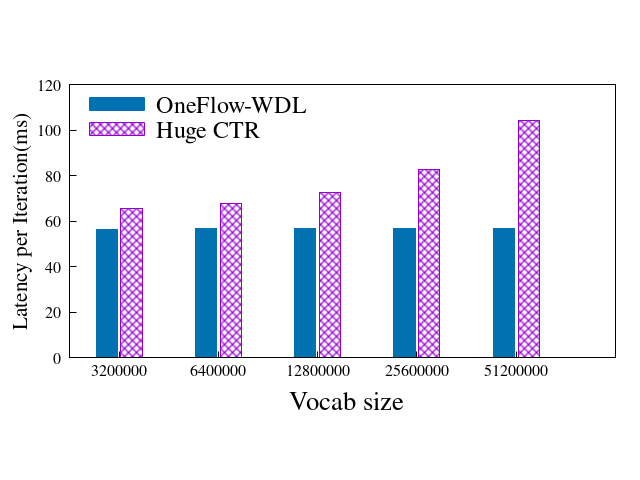
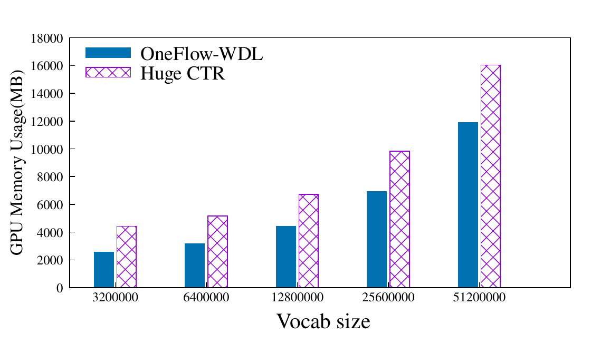
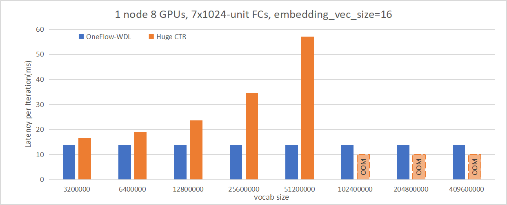
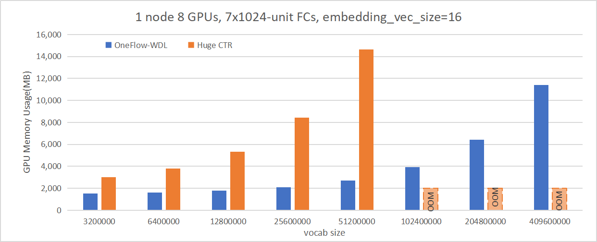
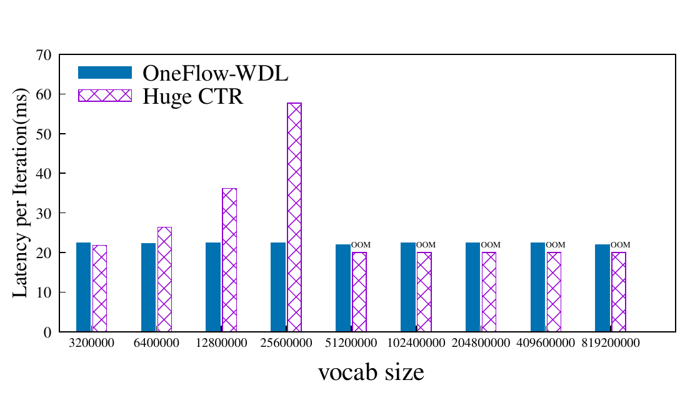
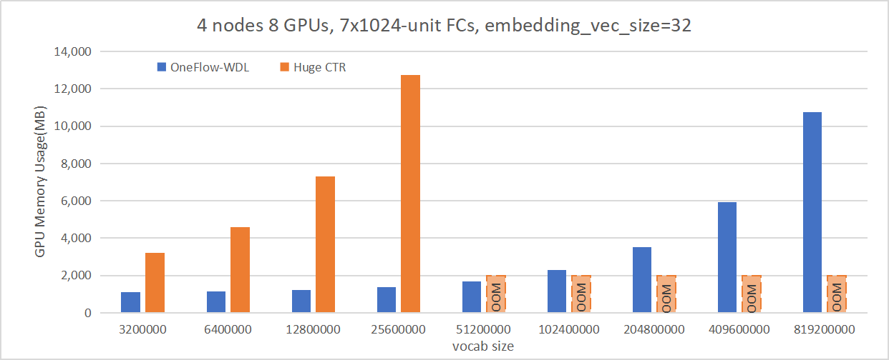

# Wide & Deep 在深度学习框架上的性能测试报告V1.0


## 测试环境

所有的测试均在4台配置了8张Tesla V100-SXM2-16GB GPU显卡上进行，每台机器具体的硬件和软件配置描述如下：

- Tesla V100-SXM2-16GB x 8
- InfiniBand 100 Gb/sec (4X EDR)， Mellanox Technologies MT27700 Family
- Intel(R) Xeon(R) Gold 5118 CPU @ 2.30GHz
- Memory 384G
- Ubuntu 16.04.4 LTS (GNU/Linux 4.4.0-116-generic x86_64)
- CUDA Version: 10.2, Driver Version: 440.33.01
- OneFlow: v0.2.0-83-gb16a8d42f 
- OneFlow-Benchmark: update_wdl@42c5515
- HugeCTR version: 2.2
- `nvidia-smi topo -m`

```
        GPU0    GPU1    GPU2    GPU3    GPU4    GPU5    GPU6    GPU7    mlx5_0  CPU Affinity
GPU0     X      NV1     NV1     NV2     NV2     SYS     SYS     SYS     NODE    0-11,24-35
GPU1    NV1      X      NV2     NV1     SYS     NV2     SYS     SYS     NODE    0-11,24-35
GPU2    NV1     NV2      X      NV2     SYS     SYS     NV1     SYS     PIX     0-11,24-35
GPU3    NV2     NV1     NV2      X      SYS     SYS     SYS     NV1     PIX     0-11,24-35
GPU4    NV2     SYS     SYS     SYS      X      NV1     NV1     NV2     SYS     12-23,36-47
GPU5    SYS     NV2     SYS     SYS     NV1      X      NV2     NV1     SYS     12-23,36-47
GPU6    SYS     SYS     NV1     SYS     NV1     NV2      X      NV2     SYS     12-23,36-47
GPU7    SYS     SYS     SYS     NV1     NV2     NV1     NV2      X      SYS     12-23,36-47
mlx5_0  NODE    NODE    PIX     PIX     SYS     SYS     SYS     SYS      X

Legend:

  X    = Self
  SYS  = Connection traversing PCIe as well as the SMP interconnect between NUMA nodes (e.g., QPI/UPI)
  NODE = Connection traversing PCIe as well as the interconnect between PCIe Host Bridges within a NUMA node
  PHB  = Connection traversing PCIe as well as a PCIe Host Bridge (typically the CPU)
  PXB  = Connection traversing multiple PCIe bridges (without traversing the PCIe Host Bridge)
  PIX  = Connection traversing at most a single PCIe bridge
  NV#  = Connection traversing a bonded set of # NVLinks

```


## 框架 & 模型

| 框架 | 版本 | Docker 来源 |模型来源|
| --------- | ------- | ----------- | ----------- |
|[OneFlow](https://github.com/Oneflow-Inc/oneflow/tree/v0.2.0)|0.2.0|             |[OneFolow-Benchmark](https://github.com/Oneflow-Inc/OneFlow-Benchmark/tree/v0.2.0/ClickThroughRate/WideDeepLearning)|
|[HugeCTR](https://github.com/NVIDIA/HugeCTR)| 2.2 ||[samples/wdl](https://github.com/NVIDIA/HugeCTR/tree/v2.2/samples/wdl)|

## Test Options

### Vocab Size(词表大小)倍增测试

持续倍增词汇量直到显存不足.

- 设备配置: 单机单卡, 单机8卡, 四机32卡
- Batch Size: 16384
- deep_embedding_vec_size（低维稠密向量维度）: 四机32卡取32, 其它情况取16
- hidden unit（隐层单元数）: 7

### Batch Size 倍增测试

持续倍增Batch Size直到显存不足.

- 设备配置: 单机单卡, 单机8卡, 四机32卡
- Deep部分词汇量: 2322444
- deep_embedding_vec_size（低维稠密向量维度）: 四机32卡取32, 其它情况取16
- hidden unit（隐层单元数）: 7

### 固定总Batch Size测试

在总Batch Size固定的情况下测试节点数和设备数不同的情况.

- 设备配置: 单机单卡, 单机8卡, 四机32卡
- Batch Size: 16384
- Vocab Size（词表大小）: 2322444
- deep_embedding_vec_size（低维稠密向量维度）: 四机32卡取32, 其它情况取16
- hidden unit（隐层单元数）: 7

### 固定单卡Batch Size测试

在单卡Batch Size固定的情况下测试节点数和设备数不同的情况.

- 设备配置: 单机单卡, 单机8卡, 四机32卡
- 每个GPU设备的Batch Size: 16384
- Vocab Size(词表大小): 2322444
- deep_embedding_vec_size（低维稠密向量维度）: 32
- hidden unit（隐层单元数）: 7

## 测试结果

以下是**Vocab Size(词表大小)倍增测试**的总结。其它类型的测试结果，包含**Batch Size倍增测试**，**固定总Batch Size测试**。请参考[OneFlow/ClickThroughRate/WideDeepLearning/reports](../OneFlow/ClickThroughRate/WideDeepLearning)和[HugeCTR/reports](../HugeCTR)获取更多细节。


**词汇量倍增测试**分别在**单机单卡**, **单机8卡**, **四机32卡**条件下进行测试。OneFlow和HugeCTR的**Latency per Iteration**和**Memory Usage**被记录下来。

简要来说，**Latency per Iteration**越小意味着性能更好，**Memory Usage**越小意味着显存管理能力越强。

我们将看到当我们不断倍增vocab Size(词表大小)时，OneFlow的**Latency per Iteration**指标基本不发生改变这意味着几乎没有性能损失。

我们还将看到在所有的测试样例中，OneFlow的 **Memory Usage**都比HugeCTR小。

### 单机单卡, batch_size = 16384, deep_embedding_vec_size（低维稠密向量维度） = 16, hidden_units_num（隐层单元数） = 7

| deep_vocab_size | OneFlow Latency per Iteration / ms | HugeCTR Latency per Iteration / ms | OneFlow Mem Usage / MB | HugeCTR Mem Usage / MB | Mem Usage Ratio |
| --------------- | ---------------------------------- | ---------------------------------- | ---------------------- | ---------------------- |-----|
| 3200000         | 56.601                             | 65.664                             | 2,557                  | 4427                   |58% |
| 6400000         | 56.862                             | 67.913                             | 3,179                  | 5177                   | 61% |
| 12800000        | 56.964                             | 72.729                             | 4,421                  | 6727                   | 66% |
| 25600000        | 56.841                             | 82.853                             | 6,913                  | 9825                   | 70% |
| 51200000        | 56.805                             | 104.458                            | 11,891                 | 16027                  | 74% |





### 单机8卡, batch_size = 16384, deep_embedding_vec_size（低维稠密向量维度） = 16, hidden_units_num（隐层单元数） = 7

| deep_vocab_size | OneFlow Latency per Iteration / ms | HugeCTR Latency per Iteration / ms | OneFlow Mem Usage / MB | HugeCTR Mem Usage / MB | Mem Usage Ratio |
| --------------- | ---------------------------------- | ---------------------------------- | ---------------------- | ---------------------- |-----|
| 3200000   | 13.837 | 16.671 | 1,533  | 3,021  | 51% |
| 6400000   | 13.948 | 19.036 | 1,613  | 3,797  | 42% |
| 12800000  | 13.847 | 23.707 | 1,775  | 5,347  | 33% |
| 25600000  | 13.772 | 34.618 | 2,087  | 8,447  | 25% |
| 51200000  | 13.974 | 57.106 | 2,713  | 14,649 | 19% |
| 102400000 | 13.846 | out of memory | 3,945  | out of memory | - |
| 204800000 | 13.785 | out of memory | 6,435  | out of memory | - |
| 409600000 | 13.845 | out of memory | 11,423 | out of memory | - |





### 4 node 32 GPUs, batch_size = 16384, deep_embedding_vec_size（低维稠密向量维度） = 32, hidden_units_num（隐层单元数） = 7

| deep_vocab_size | OneFlow Latency per Iteration / ms | HugeCTR Latency per Iteration / ms | OneFlow Mem Usage / MB | HugeCTR Mem Usage / MB | Mem Usage Ratio |
| --------------- | ---------------------------------- | ---------------------------------- | ---------------------- | ---------------------- |-----|
| 3200000   | 22.414 | 21.843        | 1,115  | 3217          | 35% |
| 6400000   | 22.314 | 26.375        | 1,153  | 4579          | 25% |
| 12800000  | 22.352 | 36.214        | 1,227  | 7299          | 17% |
| 25600000  | 22.399 | 57.718        | 1,379  | 12745         | 11% |
| 51200000  | 22.31  | out of memory | 1,685  | out of memory | - |
| 102400000 | 22.444 | out of memory | 2,293  | out of memory | - |
| 204800000 | 22.403 | out of memory | 3,499  | out of memory | - |
| 409600000 | 22.433 | out of memory | 5,915  | out of memory | - |
| 819200000 | 22.407 | out of memory | 10,745 | out of memory | - |



