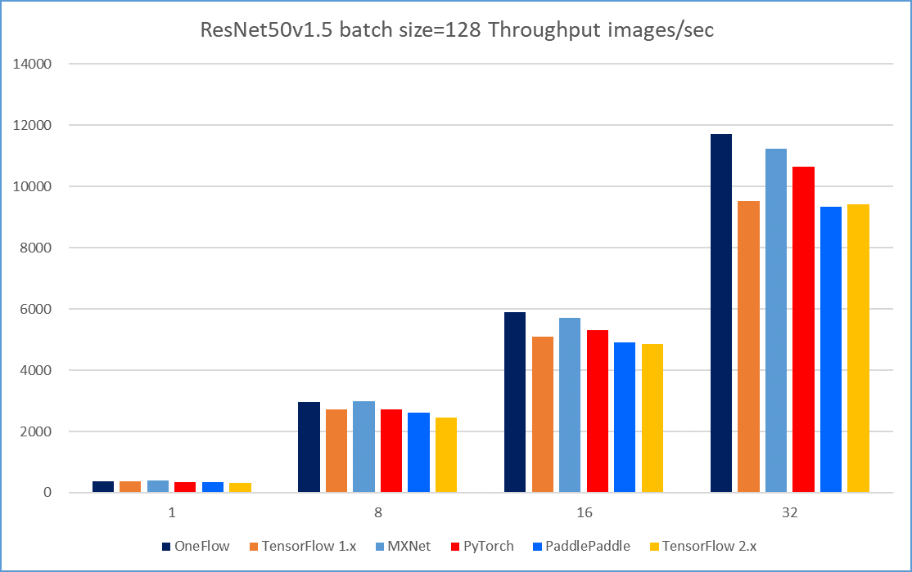
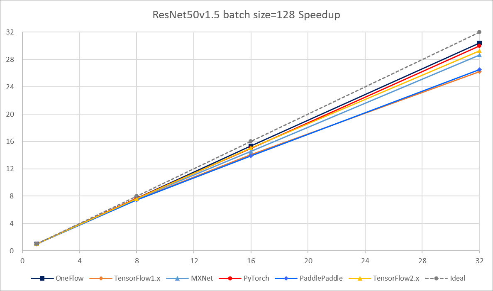
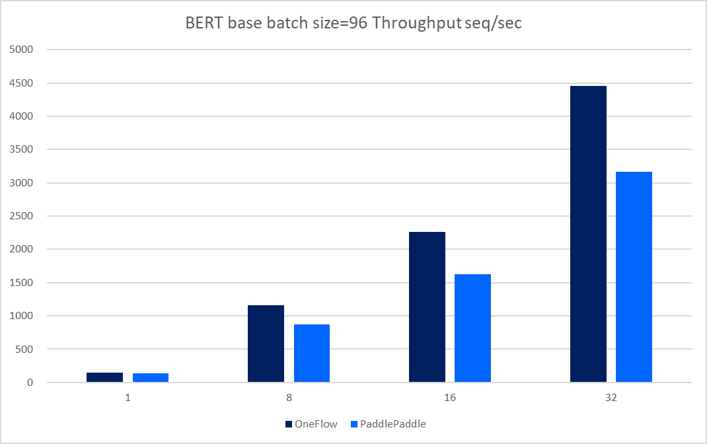
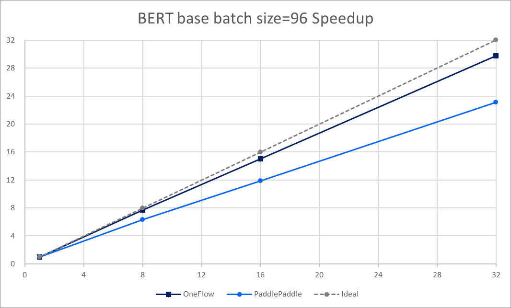
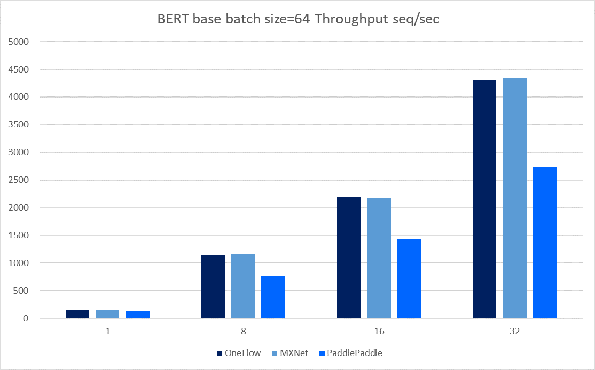
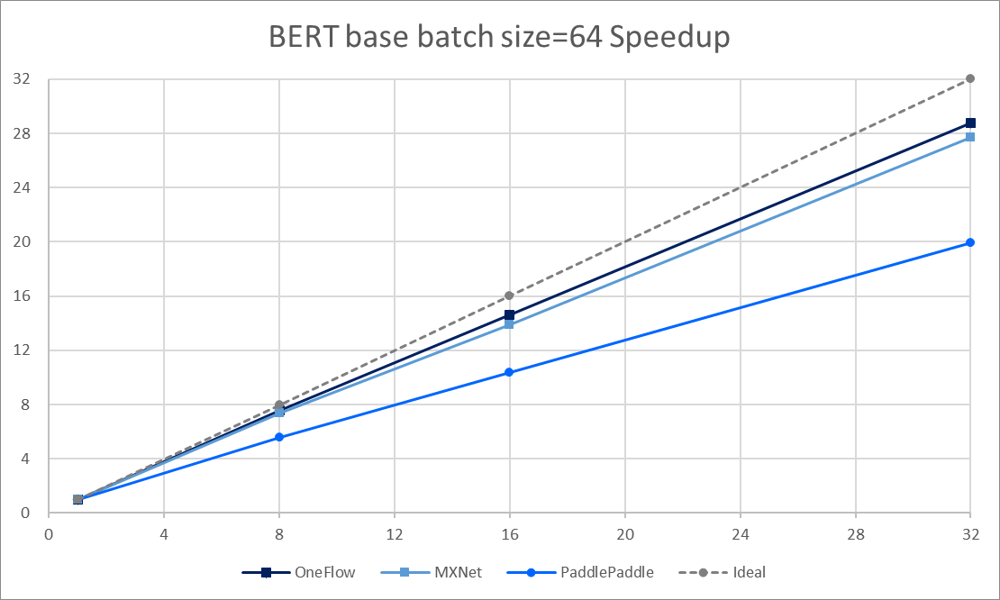
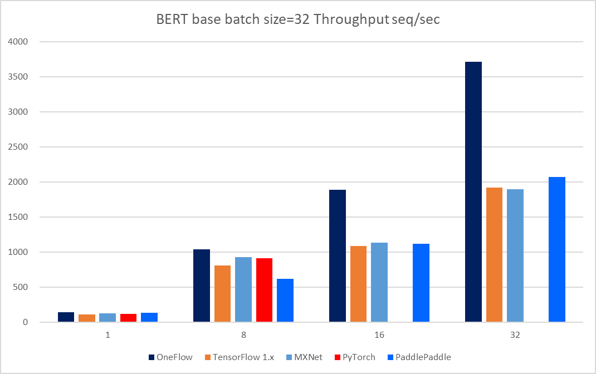
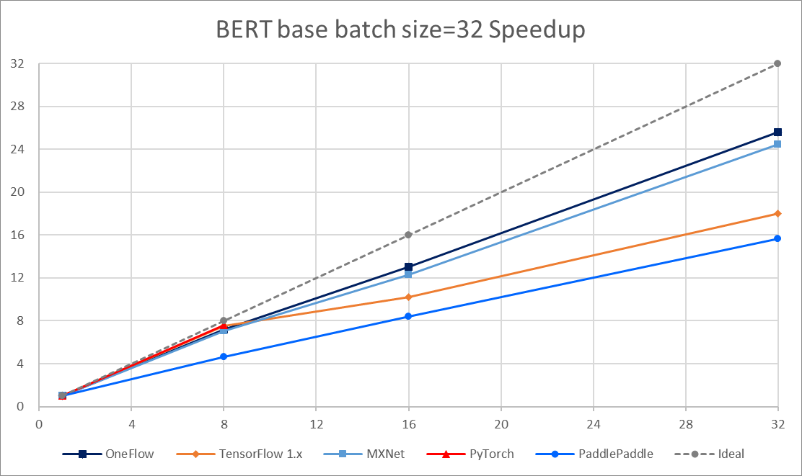

# DLPerf Benchmark Test Report V1.0

This report summarizes the results of a series of tests performed in Aug, 2020.  

## Test Environment

All tests were performed on 4 Nodes with 8x Tesla V100-SXM2-16GB GPUs, the following is the main hardware and software configuration for each:  

- Tesla V100-SXM2-16GB x 8
- InfiniBand 100 Gb/sec (4X EDR)， Mellanox Technologies MT27700 Family
- Intel(R) Xeon(R) Gold 5118 CPU @ 2.30GHz
- Memory 384G
- Ubuntu 16.04.4 LTS (GNU/Linux 4.4.0-116-generic x86_64)
- CUDA Version: 10.2, Driver Version: 440.33.01
- `nvidia-smi topo -m`

```
        GPU0    GPU1    GPU2    GPU3    GPU4    GPU5    GPU6    GPU7    mlx5_0  CPU Affinity
GPU0     X      NV1     NV1     NV2     NV2     SYS     SYS     SYS     NODE    0-11,24-35
GPU1    NV1      X      NV2     NV1     SYS     NV2     SYS     SYS     NODE    0-11,24-35
GPU2    NV1     NV2      X      NV2     SYS     SYS     NV1     SYS     PIX     0-11,24-35
GPU3    NV2     NV1     NV2      X      SYS     SYS     SYS     NV1     PIX     0-11,24-35
GPU4    NV2     SYS     SYS     SYS      X      NV1     NV1     NV2     SYS     12-23,36-47
GPU5    SYS     NV2     SYS     SYS     NV1      X      NV2     NV1     SYS     12-23,36-47
GPU6    SYS     SYS     NV1     SYS     NV1     NV2      X      NV2     SYS     12-23,36-47
GPU7    SYS     SYS     SYS     NV1     NV2     NV1     NV2      X      SYS     12-23,36-47
mlx5_0  NODE    NODE    PIX     PIX     SYS     SYS     SYS     SYS      X

Legend:

  X    = Self
  SYS  = Connection traversing PCIe as well as the SMP interconnect between NUMA nodes (e.g., QPI/UPI)
  NODE = Connection traversing PCIe as well as the interconnect between PCIe Host Bridges within a NUMA node
  PHB  = Connection traversing PCIe as well as a PCIe Host Bridge (typically the CPU)
  PXB  = Connection traversing multiple PCIe bridges (without traversing the PCIe Host Bridge)
  PIX  = Connection traversing at most a single PCIe bridge
  NV#  = Connection traversing a bonded set of # NVLinks

```

## DNN models 

### ResNet50 V1.5

| Framework Version          | Docker From                             | DNN Model Sources                                            | Features       |
| -------------------------- | --------------------------------------- | ------------------------------------------------------------ | -------------- |
| OneFlow 0.1.9              | -                                       | [OneFlow-Benchmark](https://github.com/Oneflow-Inc/OneFlow-Benchmark/tree/637bb9cdb4cc1582f13bcc171acbc8a8089d9435/Classification/cnns) | official       |
| TensorFlow 1.15.2          | nvcr.io/nvidia/tensorflow:20.03-tf1-py3 | [DeepLearningExamples/TensorFLow](https://github.com/NVIDIA/DeepLearningExamples/tree/fed7ba99cde958fda12c9e81d12b3d7e738e0590/TensorFlow/Classification/ConvNets/resnet50v1.5) | DALI+Horovod   |
| MXNet 1.6.0                | nvcr.io/nvidia/mxnet:20.03-py3          | [DeepLearningExamples/MxNet](https://github.com/NVIDIA/DeepLearningExamples/tree/e470c2150abf4179f873cabad23945bbc920cc5f/MxNet/Classification/RN50v1.5) | DALI+Horovod   |
| PyTorch 1.5.0a0+8f84ded    | nvcr.io/nvidia/pytorch:20.03-py3        | [DeepLearningExamples/PyTorch](https://github.com/NVIDIA/DeepLearningExamples/tree/46ff3707e04683e41b79af0f94a74e45f8016786/PyTorch/Classification/ConvNets/resnet50v1.5) <br>[pytorch/examples](https://github.com/pytorch/examples/tree/4b119d735b802453479d739bf823f3f7d8d5d422/imagenet) | official, DALI |
| PaddlePaddle 1.8.3.post107 | -                                       | [PaddleCV](https://github.com/PaddlePaddle/models/tree/release/1.8/PaddleCV/image_classification) | official       |
| TensorFlow 2.3             | -                                       | [TensorFlow-models](https://github.com/tensorflow/models/tree/r2.3.0/official/vision/image_classification) | official       |

### BERT Base Pretrain

| Framework Version          | Docker From                             | DNN Model Sources                                            | Features |
| -------------------------- | --------------------------------------- | ------------------------------------------------------------ | -------- |
| OneFlow 0.1.9              | -                                       | [OneFlow-Benchmark](https://github.com/Oneflow-Inc/OneFlow-Benchmark/tree/637bb9cdb4cc1582f13bcc171acbc8a8089d9435/LanguageModeling/BERT) | official |
| TensorFlow 1.15.2          | nvcr.io/nvidia/tensorflow:20.03-tf1-py3 | [DeepLearningExamples/TensorFlow](https://github.com/NVIDIA/DeepLearningExamples/tree/fed7ba99cde958fda12c9e81d12b3d7e738e0590/TensorFlow/LanguageModeling/BERT) | Horovod  |
| MXNet 1.6.0                | nvcr.io/nvidia/mxnet:20.03-py3          | [gluon-nlp](https://github.com/dmlc/gluon-nlp/tree/7b7bf60259e28b3bf1f4d70569a7e5c18e2f4b3e/scripts/bert) | Horovod  |
| PyTorch 1.5.0a0+8f84ded    | nvcr.io/nvidia/pytorch:20.03-py3        | [DeepLearningExamples/PyTorch](https://github.com/NVIDIA/DeepLearningExamples/tree/26c26761042c0e352238add07f0074e87ac66023/PyTorch/LanguageModeling/BERT) | APEX     |
| PaddlePaddle 1.8.3.post107 | -                                       | [PaddleNLP](https://github.com/PaddlePaddle/models/tree/release/1.8/PaddleNLP/pretrain_language_models/BERT) | official |

P.S.  In features:

- [APEX](https://github.com/NVIDIA/apex) is a PyTorch extension with NVIDIA-maintained utilities to streamline mixed precision and distributed training.
- NVIDIA [DALI](https://docs.nvidia.com/deeplearning/dali/release-notes/index.html) - NVIDIA Data Loading Library (DALI) is a collection of highly optimized building blocks, and an execution engine, to accelerate the pre-processing of the input data for deep learning applications. 
- [Horovod](https://github.com/horovod/horovod) is a distributed training framework for TensorFlow, Keras, PyTorch and MXNet. 

## Benchmark Test Options

- Devices Config: 1 node 1 device, 1 node 8 devices, 2 nodes 16 devices, 4 nodes 32 devices
- DataType: Float32
- XLA, TensorRT, AMP:  Not applicable.

## Benchmark Test Results

### ResNet50 V1.5

#### batch size = 128,  FP32 & Without XLA

| node num | device num | [OneFlow<br>throughput<br>(img/s)](../OneFlow/ConvNets/rn50_fp32_report_0821.md) | [TensorFlow 1.x<br>throughput<br>(img/s)](../NVIDIADeepLearningExamples/TensorFlow/Classification/ConvNets/resnet50v1.5) | [MXNet<br>throughput<br>(img/s, bsz=96)](../NVIDIADeepLearningExamples/MxNet/Classification/RN50v1.5) | [PyTorch<br>throughput<br>(img/s)](../PyTorch/resnet50v1.5) | [PaddlePaddle<br>throughput<br>(img/s)](../PaddlePaddle/resnet50v1.5) | [TensorFlow 2.x<br>throughput<br>(img/s)](../TensorFlow/resnet50v1.5) |
| -------- | ---------- | ------------------------------------------------------------ | ------------------------------------------------------------ | ------------------------------------------------------------ | ----------------------------------------------------------- | ------------------------------------------------------------ | ------------------------------------------------------------ |
| 1        | 1          | 384.85                                                       | 362.44                                                       | 389.71                                                       | 354.40                                                      | 352.72                                                       | 321.80                                                       |
| 1        | 8          | 2969.45                                                      | 2721.98                                                      | 2947.72                                                      | 2719.07                                                     | 2625.38                                                      | 2458.74                                                      |
| 2        | 16         | 5906.55                                                      | 5099.42                                                      | 5684.68                                                      | 5307.21                                                     | 4895.27                                                      | 4849.68                                                      |
| 4        | 32         | 11711.18                                                     | 9514.64                                                      | 10419.21                                                     | 10632.33                                                    | 9348.17                                                      | 9418.44                                                      |

P.S. MXNet cannot work under this configuration with batch size 128, because of OOM (Out Of Memory).

The following images show throughput and speedup of 6 implementations of ResNet50 V1.5.





### BERT Base Pretrain 

#### batch size = 96,  FP32 & Without XLA

| node num | device num | [OneFlow<br>throughput<br>(sentences/sec)](../OneFlow/BERT/bert_base_fp32_report_0822.md) | [TensorFlow 1.x<br>throughput<br>(sentences/sec)](../NVIDIADeepLearningExamples/TensorFlow/LanguageModeling/BERT) | [MXNet<br>throughput<br>(sentences/sec)](../MxNet/BERT) | [PyTorch<br>throughput<br>(sentences/sec)](../NVIDIADeepLearningExamples/PyTorch/BERT) | [PaddlePaddle<br>throughput<br>(sentences/sec)](../PaddlePaddle/bert) |
| -------- | ---------- | ------------------------------------------------------------ | ------------------------------------------------------------ | ------------------------------------------------------- | ------------------------------------------------------------ | ------------------------------------------------------------ |
| 1        | 1          | 149.84                                                       | OOM                                                          | OOM                                                     | OOM                                                          | 136.97                                                       |
| 1        | 8          | 1158.51                                                      | OOM                                                          | OOM                                                     | OOM                                                          | 868.60                                                       |
| 2        | 16         | 2257.71                                                      | OOM                                                          | OOM                                                     | OOM                                                          | 1631.36                                                      |
| 4        | 32         | 4455.97                                                      | OOM                                                          | OOM                                                     | OOM                                                          | 3167.68                                                      |

The following images show throughput and speedup of 2 implementations of BERT base with batch size per device=96.





#### batch size = 64,  FP32 & Without XLA

| node num | device num | [OneFlow<br/>throughput<br/>(sentences/sec)](../OneFlow/BERT/bert_base_fp32_report_0822.md) | [TensorFlow 1.x<br/>throughput<br/>(sentences/sec)](../NVIDIADeepLearningExamples/TensorFlow/LanguageModeling/BERT) | [MXNet<br/>throughput<br/>(sentences/sec)](../MxNet/BERT) | [PyTorch<br/>throughput<br/>(sentences/sec)](../NVIDIADeepLearningExamples/PyTorch/BERT) | [PaddlePaddle<br/>throughput<br/>(sentences/sec)](../PaddlePaddle/bert) |
| -------- | ---------- | ------------------------------------------------------------ | ------------------------------------------------------------ | --------------------------------------------------------- | ------------------------------------------------------------ | ------------------------------------------------------------ |
| 1        | 1          | 149.81                                                       | OOM                                                          | OOM                                                       | OOM                                                          | 137.27                                                       |
| 1        | 8          | 1138.89                                                      | OOM                                                          | OOM                                                       | OOM                                                          | 761.22                                                       |
| 2        | 16         | 2189.30                                                      | OOM                                                          | OOM                                                       | OOM                                                          | 1426.52                                                      |
| 4        | 32         | 4310.42                                                      | OOM                                                          | OOM                                                       | OOM                                                          | 2736.78                                                      |

The following images show throughput and speedup of 2 implementations of BERT base with batch size per device=64.





#### batch size = 32,  FP32 & Without XLA

| node num | device num | [OneFlow<br/>throughput<br/>(sentences/sec)](../OneFlow/BERT/bert_base_fp32_report_0822.md) | [TensorFlow 1.x<br/>throughput<br/>(sentences/sec)](../NVIDIADeepLearningExamples/TensorFlow/LanguageModeling/BERT) | [MXNet<br/>throughput<br/>(sentences/sec)](../MxNet/BERT) | [PyTorch<br/>throughput<br/>(sentences/sec)](../NVIDIADeepLearningExamples/PyTorch/BERT) | [PaddlePaddle<br/>throughput<br/>(sentences/sec)](../PaddlePaddle/bert) |
| -------- | ---------- | ------------------------------------------------------------ | ------------------------------------------------------------ | --------------------------------------------------------- | ------------------------------------------------------------ | ------------------------------------------------------------ |
| 1        | 1          | 145.21                                                       | 106.80                                                       | 127.05                                                    | 119.61                                                       | 132.64                                                       |
| 1        | 8          | 1042.98                                                      | 806.56                                                       | 928.03                                                    | 908.85                                                       | 615.12                                                       |
| 2        | 16         | 1890.26                                                      | 1090.20                                                      | 1136.44                                                   | TODO                                                         | 1116.02                                                      |
| 4        | 32         | 3715.08                                                      | 1923.68                                                      | 1895.50                                                   | TODO                                                         | 2073.60                                                      |

P.S. TODO means that we have not done the test (like the NGC PyTorch BERT-base multi-node test), which will be added in the near future.

The following images show throughput and speedup of 5 implementations of BERT base with batch size per device=32.





