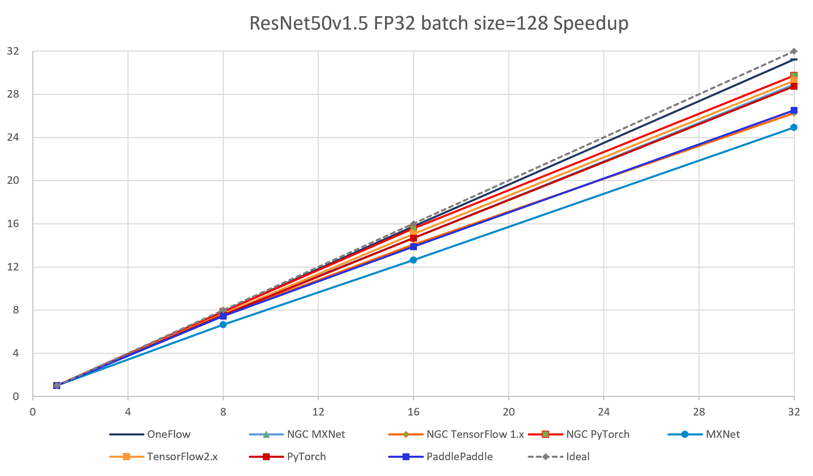
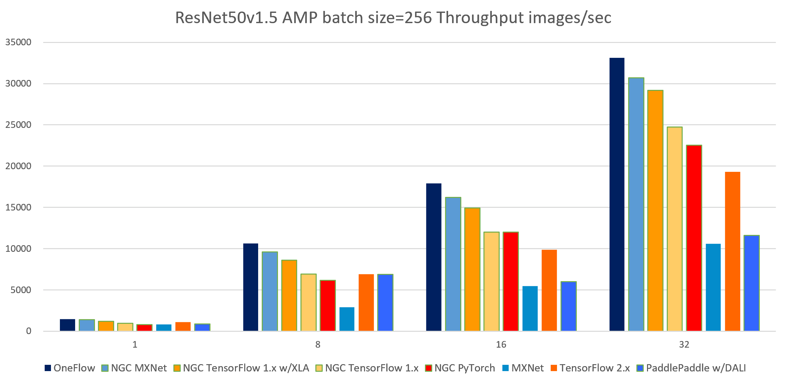
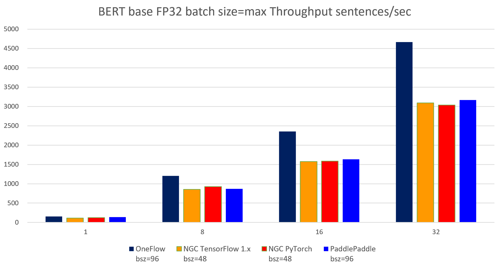
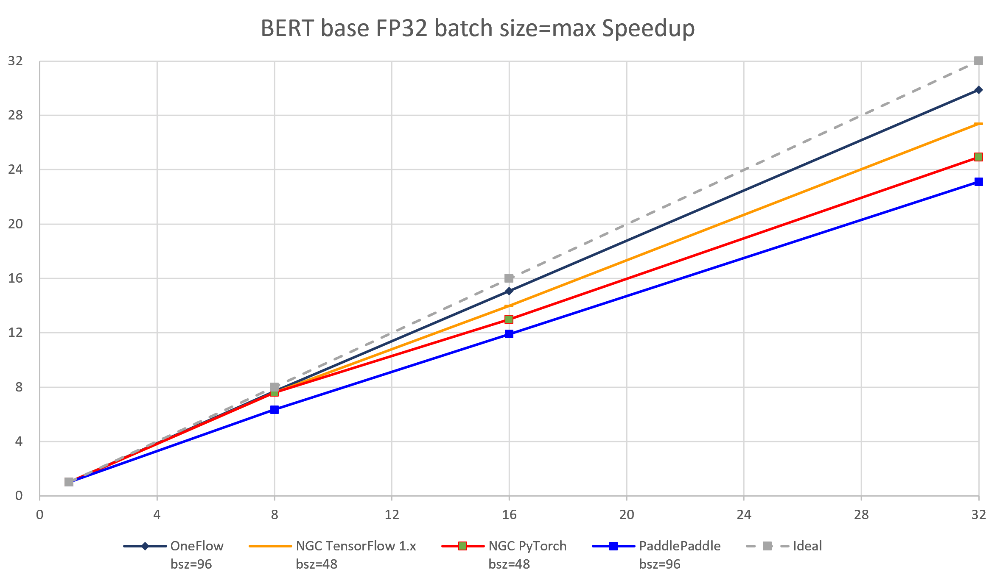
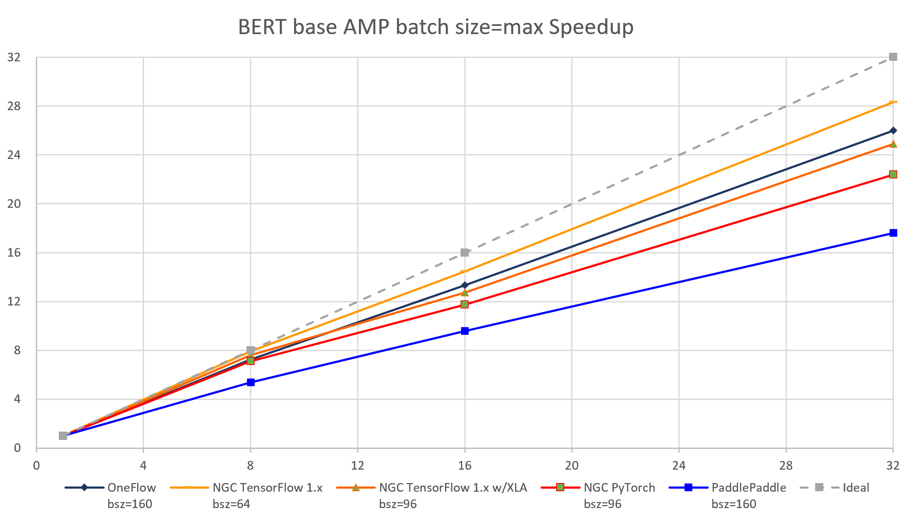

# 基于ResNet50与BERT模型的深度学习框架性能评测报告

<p align="right">2020.10</p>

<p align="right">OneFlow Inc.</p>

## 1.  简介

本报告比较了几个深度学习框架在两个经典的深度学习模型训练任务上的吞吐率及分布式训练任务上的加速比。测试均采用相同的数据集、相同的硬件环境和算法，仅比较各个框架之间的速度差异。结果表明：OneFlow在主流模型上的性能以及分布式环境下的横向扩展能力均优于其他各个框架。

 

与其他的评测相比，本次评测有两大特色：

1）     本评测强调分布式训练任务的多机扩展性

与NVIDIA [DeepLearningExamples](https://github.com/NVIDIA/DeepLearningExamples)相比，本次评测对比了多机扩展性，而NVIDIA的训练任务仅测试了单机情况。

2）     本评测仅测试框架本身的性能差异

与 [DAWNBench ](https://dawn.cs.stanford.edu/benchmark/index.html)相比，本次评测在相同的物理环境下，做了严格的算法对齐工作，让各个框架使用相同的硬件和相同的算法脚本比较吞吐率，仅评测各个框架在系统实现方面的性能表现。而DAWNBench对算法要求不限，仅对比收敛到相同精度所使用的时间，所以会把算法改进和系统改进混在一起进行整体比较。

## 2.  数据来源

各个框架的性能评测复现流程、介绍、日志、数据以及英文版报告均可以在DLPerf仓库中查看： https://github.com/Oneflow-Inc/DLPerf

## 3.  背景介绍

### 3.1  评测框架

本次评测包含了5个框架：

1. [OneFlow](https://github.com/Oneflow-Inc/oneflow)

2. [TensorFlow](https://github.com/tensorflow/tensorflow) 1.x & 2.x

3. [PyTorch](https://github.com/pytorch/pytorch)

4. [MXNet](https://github.com/apache/incubator-mxnet)

5. [PaddlePaddle](https://github.com/PaddlePaddle/Paddle)

其中 TensorFlow 1.x、PyTorch、MXNet采用的是NVIDIA深度优化后的版本，性能测试在[NGC 20.03](https://docs.nvidia.com/deeplearning/frameworks/support-matrix/index.html) 镜像中复现，性能测试的结果与NVIDIA官方仓库[DeepLearningExamples](https://github.com/NVIDIA/DeepLearningExamples)公布的结果相近。其余框架的性能测试在相同的物理环境中复现。

### 3.2  评测模型

本次评测选择了两个经典主流的深度学习模型：

1）     [ResNet-50 v1.5](https://arxiv.org/abs/1512.03385) 

2）     [BERT-Base](https://arxiv.org/abs/1810.04805) 

其中ResNet-50是计算机视觉（Computer Version）领域最主流的深度学习模型，而BERT是自然语言处理（Natural Language Processing）领域的进行预训练的主流模型。

各个框架对应的模型训练脚本，我们是从该框架的官方模型库中选取，或者从NVIDIA- [DeepLearningExamples](https://github.com/NVIDIA/DeepLearningExamples) 仓库中选取。

### 3.3  评测环境

为保证能更好的测试框架本身的性能好坏，做到公平公正，本次测评所有的测试均在相同的物理集群中测试，使用相同的软件环境等。

测试环境共有**4台机器，每台机器配置了8张V100 GPU显卡**。（每台机器配置与NVIDA[ DGX-1](https://www.nvidia.com/en-us/data-center/dgx-1/)接近）每台机器具体的硬件和软件配置描述如下：

- Tesla V100-SXM2-16GB x 8
- InfiniBand 100 Gb/sec (4X EDR)， Mellanox Technologies MT27700 Family
- Intel(R) Xeon(R) Gold 5118 CPU @ 2.30GHz
- Memory 384G
- Ubuntu 16.04.4 LTS (GNU/Linux 4.4.0-116-generic x86_64)
- CUDA Version: 10.2, Driver Version: 440.33.01
- `nvidia-smi topo -m`

```
        GPU0    GPU1    GPU2    GPU3    GPU4    GPU5    GPU6    GPU7    mlx5_0  CPU Affinity
GPU0     X      NV1     NV1     NV2     NV2     SYS     SYS     SYS     NODE    0-11,24-35
GPU1    NV1      X      NV2     NV1     SYS     NV2     SYS     SYS     NODE    0-11,24-35
GPU2    NV1     NV2      X      NV2     SYS     SYS     NV1     SYS     PIX     0-11,24-35
GPU3    NV2     NV1     NV2      X      SYS     SYS     SYS     NV1     PIX     0-11,24-35
GPU4    NV2     SYS     SYS     SYS      X      NV1     NV1     NV2     SYS     12-23,36-47
GPU5    SYS     NV2     SYS     SYS     NV1      X      NV2     NV1     SYS     12-23,36-47
GPU6    SYS     SYS     NV1     SYS     NV1     NV2      X      NV2     SYS     12-23,36-47
GPU7    SYS     SYS     SYS     NV1     NV2     NV1     NV2      X      SYS     12-23,36-47
mlx5_0  NODE    NODE    PIX     PIX     SYS     SYS     SYS     SYS      X

Legend:

  X    = Self
  SYS  = Connection traversing PCIe as well as the SMP interconnect between NUMA nodes (e.g., QPI/UPI)
  NODE = Connection traversing PCIe as well as the interconnect between PCIe Host Bridges within a NUMA node
  PHB  = Connection traversing PCIe as well as a PCIe Host Bridge (typically the CPU)
  PXB  = Connection traversing multiple PCIe bridges (without traversing the PCIe Host Bridge)
  PIX  = Connection traversing at most a single PCIe bridge
  NV#  = Connection traversing a bonded set of # NVLinks

```

### 3.4  评测配置

针对每个框架的每个模型，我们都测试了其分布式环境下的吞吐率，包含了不同的batch size、是否经过XLA优化加速、是否使用自动混合精度训练。下面简要介绍一下相关概念：

#### 3.4.1  分布式（多机 与 多卡）

对于每一个框架的每一次性能测试，我们都至少测试了 1机1卡、1机8卡、2机16卡、4机32卡这几种情况。用于评价各个框架在分布式训练情况下的横向扩展能力。

#### 3.4.2  Batch Size

在本测试报告中，batch size表示的是深度学习训练过程中每个设备（GPU/卡）上的样例个数。简称bsz（batch size per GPU）。由于各个深度学习框架的显存管理策略不同，内存优化程度也不一样，所以对于相同的深度学习模型，各个框架在同样显存大小的GPU上所能支持的最大batch size是不同的。通常来说，batch size越大，则性能评测结果越好。

#### 3.4.3  XLA

[XLA](https://www.tensorflow.org/xla) (Accelerated Linear Algebra)是一种深度学习编译器，可以在不改变源码的情况下进行线性代数加速。针对支持XLA的深度学习框架我们也会测试其开启或关闭状态下的性能表现。

#### 3.4.4  AMP 自动混合精度

AMP(Automatic Mixed Precision) 自动混合精度，在GPU上可以加速训练过程，与float32精度相比，AMP在某些GPU上可以做到3倍左右的速度提升。我们对支持AMP的深度学习框架会测试其开启或关闭AMP的性能表现。

### 3.5  评测规则

根据3.4小节介绍的评测配置，针对每个框架每个模型的一个测试（each test case），我们都会遍历如下可能的参数：

1）     机器数（1，2，4），GPU数（1，2，4，8）

2）     每个设备上的batch size

3）     是否开启XLA

4）     是否开启AMP

针对该测试，我们会重复几次（5-7次），并选取这几次测试的中位数作为实际的测试结果。测试结果选取规则尽可能的屏蔽掉随机因素的干扰，使得测试结果接近真实值。

### 3.6  评测指标

我们选取吞吐率（throughput）和加速比（speedup）作为我们的评测指标。

吞吐率表示了深度学习框架的处理速度，吞吐率越高，则训练一个深度学习模型所需的时间越短，深度学习框架的性能就越高。加速比表示了深度学习框架多机多卡的扩展性，加速比越高，则额外增加一个硬件设备所带来的收益就越高，深度学习框架的多机扩展性就越好。

#### 3.6.1  吞吐率

吞吐率表示训练过程中深度学习框架每秒处理的样例个数。对于图片分类任务而言，表示每秒处理多少张图片（images/sec）；对于自然语言处理任务而言，表示每秒处理多少个句子（sentences/sec）。

为了得到连续且稳定的吞吐率，我们会过滤掉训练一开始的几个step。在实际测试中，一般我们过滤了前20个step，并选取后续100个step的均值计算吞吐率。（有些框架在有些训练模型上的log是按照100的倍数输出的，这时我们会过滤掉前100个step，选取后面几百个step计算均值。）

#### 3.6.2  加速比

通过加速比，可测试出深度学习框架在分布式训练环境下的横向扩展能力。加速比是针对该框架在某一分布式配置下（如n台机器，共m个设备）的吞吐率 与 该框架在相同配置下（相同的bsz per GPU，相同的参数）单机单卡的吞吐率的比值。理想情况下，加速比为m（m>1），但每个框架都只能尽可能接近m，而无法达到和超过m。

## 4.  ResNet-50 v1.5 性能测试

### 4.1  参与评测的各个框架和模型库介绍

参与本次评测的框架、版本、模型库、以及额外特性如表4-1所示：

<p align="center">表 4-1 参与ResNet50-v1.5 性能评测的各个框架介绍</p>

| Framework                                                    | Version         | Docker From                             | DNN Model Sources                                            | Features                 |
| ------------------------------------------------------------ | --------------- | --------------------------------------- | ------------------------------------------------------------ | ------------------------ |
| [OneFlow](https://github.com/Oneflow-Inc/oneflow/tree/v0.2.0) | 0.2.0           | -                                       | [OneFlow-Benchmark](https://github.com/Oneflow-Inc/OneFlow-Benchmark/tree/v0.2.0/Classification/cnns) | official                 |
| [NGC TensorFlow 1.x](https://ngc.nvidia.com/catalog/containers/nvidia:tensorflow/tags) | 1.15.2          | nvcr.io/nvidia/tensorflow:20.03-tf1-py3 | [DeepLearningExamples/TensorFLow](https://github.com/NVIDIA/DeepLearningExamples/tree/fed7ba99cde958fda12c9e81d12b3d7e738e0590/TensorFlow/Classification/ConvNets/resnet50v1.5) | DALI+Horovod+XLA         |
| [NGC PyTorch](https://ngc.nvidia.com/catalog/containers/nvidia:pytorch/tags) | 1.5.0a0+8f84ded | nvcr.io/nvidia/pytorch:20.03-py3        | [DeepLearningExamples/PyTorch](https://github.com/NVIDIA/DeepLearningExamples/tree/46ff3707e04683e41b79af0f94a74e45f8016786/PyTorch/Classification/ConvNets/resnet50v1.5) | DALI+APEX                |
| [NGC MXNet](https://ngc.nvidia.com/catalog/containers/nvidia:mxnet/tags) | 1.6.0           | nvcr.io/nvidia/mxnet:20.03-py3          | [DeepLearningExamples/MxNet](https://github.com/NVIDIA/DeepLearningExamples/tree/e470c2150abf4179f873cabad23945bbc920cc5f/MxNet/Classification/RN50v1.5) | DALI+Horovod             |
| [PyTorch](https://github.com/pytorch/pytorch/tree/v1.6.0)    | 1.6.0           | -                                       | [pytorch/examples](https://github.com/pytorch/examples/tree/4b119d735b802453479d739bf823f3f7d8d5d422/imagenet) | official                 |
| [PaddlePaddle](https://github.com/PaddlePaddle/Paddle/tree/v1.8.3) | 1.8.3.post107   | -                                       | [PaddleCV](https://github.com/PaddlePaddle/models/tree/release/1.8/PaddleCV/image_classification) | official / ref with DALI |
| [TensorFlow 2.x](https://github.com/tensorflow/tensorflow/tree/v2.3.0) | 2.3.0           | -                                       | [TensorFlow-models](https://github.com/tensorflow/models/tree/r2.3.0/official/vision/image_classification) | official                 |

注： 

- 其中以NGC开头的表示该框架是从NVIDIA GPU Cloud (NGC) Container ([https://ngc.nvidia.com](https://ngc.nvidia.com/)) 仓库中获取的。该容器中的框架经过英伟达的深度优化，性能测试表现优于原生框架。

- 在Features一栏中描述了测试框架额外新增的特性，这些额外特性可以帮助框架实现分布式、自动混合精度或者提升性能表现。
  - [APEX](https://github.com/NVIDIA/apex) 是NVIDIA提供的一个PyTorch的扩展插件，用于帮助PyTorch实现自动混合精度以及分布式训练。
  - [DALI](https://docs.nvidia.com/deeplearning/dali/release-notes/index.html) - NVIDIA Data Loading Library (DALI) 是一个高效的数据读取引擎，用于给深度学习框架加速输入数据的读取速度。
  - [Horovod ](https://github.com/horovod/horovod) 是一个帮助TensorFlow、PyTorch、MXNet等框架支持分布式训练的框架。
  - [XLA](https://www.tensorflow.org/xla) (Accelerated Linear Algebra) 是一种深度学习编译器，可以在不改变源码的情况下进行线性代数加速。

### 4.2  FP32 batch size = 128各框架吞吐率 (images/sec)

<p align="center">表 4-2 ResNet50-v1.5 FP32 batch size = 128 各个框架吞吐率对比</p>

| node num | device num | [OneFlow](../OneFlow) | [NGC<br>TensorFlow 1.x](../NVIDIADeepLearningExamples/TensorFlow/Classification/ConvNets/resnet50v1.5) | [NGC<br>PyTorch]() | [NGC<br>MXNet](../NVIDIADeepLearningExamples/MxNet/Classification/RN50v1.5) | [PyTorch](../PyTorch/resnet50v1.5) | [PaddlePaddle](../PaddlePaddle/resnet50v1.5) | [TensorFlow 2.x](../TensorFlow/resnet50v1.5) |
| -------- | ---------- | --------------------- | ------------------------------------------------------------ | ------------------ | ------------------------------------------------------------ | ---------------------------------- | -------------------------------------------- | -------------------------------------------- |
| 1        | 1          | 397.64                | 362.44                                                       | 367.29             | 392.24                                                       | 348.62                             | 352.72                                       | 321.80                                       |
| 1        | 8          | 3130.34               | 2721.98                                                      | 2887.65            | 3006.98                                                      | 2632.93                            | 2625.38                                      | 2458.74                                      |
| 2        | 16         | 6260.30               | 5099.42                                                      | 5716.79            | 5758.49                                                      | 5115.40                            | 4895.27                                      | 4849.68                                      |
| 4        | 32         | 12411.97              | 9514.64                                                      | 10917.09           | 11331.93                                                     | 10021.29                           | 9348.17                                      | 9418.44                                      |


<p align="center">图 4-1 7个框架实现在ResNet50-v1.5模型上（FP32 batch size = 128）的吞吐率对比</p>



<p align="center">图 4-2 7个框架实现在ResNet50-v1.5模型上（FP32 batch size = 128）的加速比对比</p>

### 4.3  AMP batch size = 256各框架吞吐率 (images/sec)

<p align="center">表 4-3 ResNet50-v1.5 AMP batch size = 256 各个框架吞吐率对比</p>

| node num | device num | [OneFlow](../OneFlow) | [NGC<br>TensorFlow 1.x<br>W/O XLA<br>bsz=224](../NVIDIADeepLearningExamples/TensorFlow/Classification/ConvNets/resnet50v1.5) | [NGC<br>TensorFlow 1.x<br>with XLA<br>bsz=224](../NVIDIADeepLearningExamples/TensorFlow/Classification/ConvNets/resnet50v1.5) | [NGC<br>PyTorch]() | [NGC<br>MXNet](../NVIDIADeepLearningExamples/MxNet/Classification/RN50v1.5) | [PaddlePaddle<br>W/O DALI<br>bsz=224](../PaddlePaddle/resnet50v1.5) | [TensorFlow 2.x](../TensorFlow/resnet50v1.5) | [PaddlePaddle<br>with DALI<br>reference](https://github.com/PaddlePaddle/models/tree/release/1.8/PaddleCV/image_classification#%E6%B7%B7%E5%90%88%E7%B2%BE%E5%BA%A6%E8%AE%AD%E7%BB%83)<sup>[1]</sup> |
| -------- | ---------- | --------------------- | ------------------------------------------------------------ | ------------------------------------------------------------ | ------------------ | ------------------------------------------------------------ | ------------------------------------------------------------ | -------------------------------------------- | ------------------------------------------------------------ |
| 1        | 1          | 1472.72               | 945.18                                                       | 1198.55                                                      | 802.9              | 1393.87                                                      | 1034.64                                                      | 1075.27                                      | 1035                                                         |
| 1        | 8          | 10629.32              | 6903.42                                                      | 8588.45                                                      | 6154.66            | 9621.31                                                      | 4380.66                                                      | 6898.00                                      | 7840                                                         |
| 2        | 16         | 17920.40              | 12021.09                                                     | 14931.03                                                     | 11991.94           | 16219.03                                                     | 6358.43                                                      | 9870.15                                      | 14277                                                        |
| 4        | 32         | 33141.02              | 24734.22                                                     | 29171.69                                                     | 22551.16           | 30713.68                                                     | 10633.22                                                     | 19314.31                                     | 28594                                                        |

注：

- 其中NGC TensorFlow 1.x 和 PaddlePaddle 的batch size = 224，因为batch size = 256是会OOM（out of memory）。

- [1] 由于我们尝试安装PaddlePaddle的[DALI-paddle](https://github.com/PaddlePaddle/models/tree/release/1.8/PaddleCV/image_classification#dali预处理) 插件后的测试性能仍然不理想（Paddle官方测试使用的DALI的镜像未开源），所以表中的“**PaddlePaddle** **W/O DALI**”一列是PaddlePaddle原生框架在没有使用DALI的情况下的吞吐率。我们引用了PaddlePaddle官方提供的在v100（32G）上测试的吞吐率[28594 imgs/s](https://github.com/PaddlePaddle/models/tree/release/1.8/PaddleCV/image_classification#混合精度训练)数据作为对比参考， 放在了“[**PaddlePaddle** **w/ DALI** **ref**](https://github.com/PaddlePaddle/models/tree/release/1.8/PaddleCV/image_classification#混合精度训练)”这一列。 



<p align="center">图 4-3 8个框架实现在ResNet50-v1.5模型上（AMP batch size = 256）的吞吐率对比</p>


<p align="center">图 4-4 8个框架实现在ResNet50-v1.5模型上（AMP batch size = 256）的加速比对比</p>

## 5.  BERT-base pretrain性能测试

### 5.1 参与评测的各个框架和模型库介绍

<p align="center">表 5-1 参与 BERT-base pretrain训练任务 性能评测的各个框架介绍</p>

| Framework                                                    | Version         | Docker From                             | DNN Model Sources                                            | Features |
| ------------------------------------------------------------ | --------------- | --------------------------------------- | ------------------------------------------------------------ | -------- |
| [OneFlow](https://github.com/Oneflow-Inc/oneflow/tree/v0.2.0) | 0.2.0           | -                                       | [OneFlow-Benchmark](https://github.com/Oneflow-Inc/OneFlow-Benchmark/tree/v0.2.0/LanguageModeling/BERT) | official |
| [NGC TensorFlow 1.x](https://ngc.nvidia.com/catalog/containers/nvidia:tensorflow/tags) | 1.15.2          | nvcr.io/nvidia/tensorflow:20.03-tf1-py3 | [DeepLearningExamples/TensorFlow](https://github.com/NVIDIA/DeepLearningExamples/tree/fed7ba99cde958fda12c9e81d12b3d7e738e0590/TensorFlow/LanguageModeling/BERT) | Horovod  |
| [NGC PyTorch](https://ngc.nvidia.com/catalog/containers/nvidia:pytorch/tags) | 1.5.0a0+8f84ded | nvcr.io/nvidia/pytorch:20.03-py3        | [DeepLearningExamples/PyTorch](https://github.com/NVIDIA/DeepLearningExamples/tree/26c26761042c0e352238add07f0074e87ac66023/PyTorch/LanguageModeling/BERT) | APEX     |
| [MXNet](https://github.com/apache/incubator-mxnet/tree/1.6.0) | 1.6.0           | -                                       | [gluon-nlp](https://github.com/dmlc/gluon-nlp/tree/7b7bf60259e28b3bf1f4d70569a7e5c18e2f4b3e/scripts/bert) | Horovod  |
| [PaddlePaddle](https://github.com/PaddlePaddle/Paddle/tree/v1.8.3) | 1.8.3.post107   | -                                       | [PaddleNLP](https://github.com/PaddlePaddle/models/tree/release/1.8/PaddleNLP/pretrain_language_models/BERT) | official |

注：

- 由于BERT网络各个框架所需的内存差别比较大，所以各个框架所能支持的最大batch size差别也比较大。而对于BERT这样模型相对很大的网络，所能支持的batch size越大，多卡扩展性和加速比会越好。所以针对FP32和AMP，我们分别选取了两个batch size 进行性能比较。在FP32情况下，我们选取了各个框架均能支持的batch size = 32 的情况进行比较，另外比较了各个框架的最大batch size情况下的吞吐率；在AMP情况下，我们选取了batch size = 64进行基准测试比较，另外还比较了各个框架最大batch size情况下的吞吐率。

### 5.2  FP32 batch size = 32各框架吞吐率 (sentences/sec)

<p align="center">表 5-2 BERT-base FP32 batch size = 32 各个框架吞吐率对比</p>

| node num | device num | [OneFlow](../OneFlow) | [NGC<br>TensorFlow 1.x](../NVIDIADeepLearningExamples/TensorFlow/LanguageModeling/BERT) | [NGC<br>PyTorch](../NVIDIADeepLearningExamples/PyTorch/BERT) | [PaddlePaddle](../PaddlePaddle/bert) | <sup>[2]</sup>[OneFlow<br>W/O clip](../OneFlow) | <sup>[2]</sup>[MXNet<br>W/O clip](../MxNet/BERT) |
| -------- | ---------- | --------------------- | ------------------------------------------------------------ | ------------------------------------------------------------ | ------------------------------------ | ----------------------------------------------- | ------------------------------------------------ |
| 1        | 1          | 152.89                | 107.33                                                       | 119.60                                                       | 132.64                               | 153.94                                          | 150.11                                           |
| 1        | 8          | 1105.55               | 790.03                                                       | 921.32                                                       | 615.12                               | 1194.48                                         | 1058.60                                          |
| 2        | 16         | 2015.78               | 1404.04                                                      | 1499.40                                                      | 1116.02                              | 2181.51                                         | 1845.65                                          |
| 4        | 32         | 3689.80               | 2727.90                                                      | 2885.81                                                      | 2073.60                              | 4019.45                                         | 3671.45                                          |

注：

- [2] 由于MXNet的BERT脚本仓库：[gluon-nlp](https://github.com/dmlc/gluon-nlp/tree/7b7bf60259e28b3bf1f4d70569a7e5c18e2f4b3e/scripts/bert)并没有在其Optimizer中支持**clip_by_ global_norm**操作，而该操作会对最终的性能表现以及收敛的最终精度有影响（W/O clip 相比于 clip，多卡情况下性能会有5%到10%的提升），至于其他框架均默认支持了clip操作。所以我们不把MXNet的性能测试数据放在最终的图表展示中。详情见：[MXNet BERT W/O clip 说明](https://github.com/Oneflow-Inc/DLPerf/tree/master/MxNet/BERT#说明)。为了更清楚的对比性能，我们也测试了OneFlow W/O clip的数据，作为对比参考。


<p align="center">图 5-1 4个框架实现在BERT-base模型上（FP32 batch size = 32）的吞吐率对比</p>


<p align="center">图 5-2 4个框架实现在BERT-base模型上（FP32 batch size = 32）的加速比对比</p>

### 5.3  FP32 batch size = max 各框架吞吐率 (sentences/sec)

<p align="center">表 5-3 BERT-base FP32 batch size = max 各个框架吞吐率对比</p>

| node num | device num | [OneFlow<br>bsz=96](../OneFlow) | [NGC<br>TensorFlow 1.x<br>bsz=48](../NVIDIADeepLearningExamples/TensorFlow/LanguageModeling/BERT) | [NGC<br>PyTorch<br>bsz=48](../NVIDIADeepLearningExamples/PyTorch/BERT) | [PaddlePaddle<br>bsz=96](../PaddlePaddle/bert) | [OneFlow<br>W/O clip<br>bsz=96](../OneFlow) | [MXNet<br>W/O clip<br>bsz=64](../MxNet/BERT) |
| -------- | ---------- | ------------------------------- | ------------------------------------------------------------ | ------------------------------------------------------------ | ---------------------------------------------- | ------------------------------------------- | -------------------------------------------- |
| 1        | 1          | 156.02                          | 112.76                                                       | 121.94                                                       | 136.97                                         | 156.25                                      | 156.76                                       |
| 1        | 8          | 1201.70                         | 855.45                                                       | 928.01                                                       | 868.60                                         | 1234.65                                     | 1153.08                                      |
| 2        | 16         | 2352.92                         | 1576.88                                                      | 1584.32                                                      | 1631.36                                        | 2425.97                                     | 2172.62                                      |
| 4        | 32         | 4664.10                         | 3089.74                                                      | 3039.30                                                      | 3167.68                                        | 4799.64                                     | 4340.89                                      |



<p align="center">图 5-3 4个框架实现在BERT-base模型上（FP32 batch size = max）的吞吐率对比</p>



<p align="center">图 5-4 4个框架实现在BERT-base模型上（FP32 batch size = max）的加速比对比</p>

### 5.4  AMP batch size = 64 各框架吞吐率 (sentences/sec)

<p align="center">表 5-4 BERT-base AMP batch size = 64 各个框架吞吐率对比</p>

| node num | device num | [OneFlow](../OneFlow) | [NGC<br>TensorFlow 1.x<br>W/O XLA](../NVIDIADeepLearningExamples/TensorFlow/LanguageModeling/BERT) | [NGC<br>TensorFlow 1.x<br>with XLA](../NVIDIADeepLearningExamples/TensorFlow/LanguageModeling/BERT) | [NGC<br>PyTorch](../NVIDIADeepLearningExamples/PyTorch/BERT) | [PaddlePaddle](../PaddlePaddle/bert) | [OneFlow<br>W/O clip](../OneFlow) | [MXNet<br>W/O clip](../MxNet/BERT) |
| -------- | ---------- | --------------------- | ------------------------------------------------------------ | ------------------------------------------------------------ | ------------------------------------------------------------ | ------------------------------------ | --------------------------------- | ---------------------------------- |
| 1        | 1          | 534.72                | 183.25                                                       | 422.53                                                       | 444.51                                                       | 289.23                               | 552.48                            | 473.76                             |
| 1        | 8          | 3399.43               | 1452.59                                                      | 3112.73                                                      | 3251.7                                                       | 1298.96                              | 3897.19                           | 3107.1                             |
| 2        | 16         | 5745.56               | 2653.74                                                      | 5050.86                                                      | 4936.92                                                      | 1999.38                              | 6669.93                           | 5723.26                            |
| 4        | 32         | 9911.78               | 5189.07                                                      | 9409.20                                                      | 9331.72                                                      | 3406.36                              | 11195.72                          | 11269.14                           |


<p align="center">图 5-5 5个框架实现在BERT-base模型上（AMP batch size = 64）的吞吐率对比</p>


<p align="center">图 5-6 5个框架实现在BERT-base模型上（AMP batch size = 64）的加速比对比</p>

### 5.5  AMP batch size = max 各框架吞吐率 (sentences/sec)

<p align="center">表 5-5 BERT-base AMP batch size = max 各个框架吞吐率对比</p>

| node num | device num | [OneFlow<br>bsz=160](../OneFlow) | [NGC<br>TensorFlow 1.x<br>W/O XLA<br>bsz=64](../NVIDIADeepLearningExamples/TensorFlow/LanguageModeling/BERT) | [NGC<br>TensorFlow 1.x<br>with XLA<br>bsz=96](../NVIDIADeepLearningExamples/TensorFlow/LanguageModeling/BERT) | [NGC<br>PyTorch<br>bsz=96](../NVIDIADeepLearningExamples/PyTorch/BERT) | [PaddlePaddle<br>bsz=160](../PaddlePaddle/bert) | [OneFlow<br>W/O clip<br>bsz=160](../OneFlow) | [MXNet<br>W/O clip<br>bsz=128](../MxNet/BERT) |
| -------- | ---------- | -------------------------------- | ------------------------------------------------------------ | ------------------------------------------------------------ | ------------------------------------------------------------ | ----------------------------------------------- | -------------------------------------------- | --------------------------------------------- |
| 1        | 1          | 605.11                           | 183.25                                                       | 468.10                                                       | 462.35                                                       | 309.68                                          | 613.93                                       | 544.31                                        |
| 1        | 8          | 4381.66                          | 1452.59                                                      | 3559.8                                                       | 3287.12                                                      | 1666.54                                         | 4683.36                                      | 3825.21                                       |
| 2        | 16         | 8075.16                          | 2653.74                                                      | 5960.14                                                      | 5426.07                                                      | 2969.85                                         | 8777.57                                      | 7327.50                                       |
| 4        | 32         | 15724.70                         | 5189.07                                                      | 11650.0                                                      | 10349.12                                                     | 5452.35                                         | 17210.63                                     | 14822.31                                      |


<p align="center">图 5-7 5个框架实现在BERT-base模型上（AMP batch size = max）的吞吐率对比</p>



<p align="center">图 5-8 5个框架实现在BERT-base模型上（AMP batch size = max）的加速比对比</p>

## 6.  性能评测经验分享

### 6.1  性能评测总结

根据上述性能测试结果，我们得出结论：在ResNet50 和 BERT-base两个模型中，无论是Float32类型还是自动混合精度，OneFlow的性能表现都优于其他各个框架。

在复现各个框架的性能评测过程中，我们对比了OneFlow框架和其他框架的性能差异 以及 复现难易程度，总结了一些优缺点。

#### 6.1.1  其他各个框架常见的不足

根据我们的复现流程以及实验数据的支撑，我们发现：

1）     很多框架的数据读取pipeline性能有瓶颈，尤其是CNN网络的AMP训练，常常依赖DALI才能达到理想的性能结果。

2）     在多卡训练时，其他官方框架和官方提供的模型脚本的默认配置一般跑不出最好的吞吐率，经常需要修改数据读取的参数（如PyTorch的worker数量，以及PaddlePaddle的reader_thread参数等）并测试多次才能找到最佳的配置参数。

3）     有些框架的分布式性能表现不如使用Horovod性能更高。

4）     很多框架和模型脚本实现的分布式训练易用性不够好，常常需要我们的测试工程师进行额外的踩坑和脚本修复、第三方依赖安装才能完成分布式训练，有些框架的官方脚本只支持单机，多机即使经过调试、修改代码也难以运行成功。

#### 6.1.2  OneFlow的优势

1）     OneFlow分布式训练非常易用。

2）     OneFlow不需要依赖DALI和Horovod就可以实现极致的分布式训练性能。

3）     OneFlow多卡训练不需要调试参数，就可以在各种情况下达到最快。

### 6.2  其他各个框架性能评测复现踩坑经验

#### 6.2.1  框架版本与模型库版本

由于各个框架存在不同版本，对应模型的项目代码也在不断维护和更新，我们复现一个项目时，需要熟读项目的readme，然后精确地匹配到对应的commit，保证代码版本和框架版本相匹配，才能将由于代码/框架版本不匹配导致各种问题的概率降至最低。

#### 6.2.2  分布式训练问题汇总

详细说明请见： https://github.com/Oneflow-Inc/DLPerf/issues/75

**1）**     **horovod/mpi多机运行失败**

无论是在物理机还是nvidia-ngc容器中，要运行horovod/mpi，都需要提前在节点之间配置ssh免密登录，保证用于通信的端口可以互相连通。

如：

```bash
# export PORT=10001
horovodrun -np ${gpu_num} \
-H ${node_ip} -p ${PORT} \
--start-timeout 600 \
python3  train.py ${CMD} 2>&1 | tee ${log_file}

# 或者：
mpirun --allow-run-as-root -oversubscribe -np ${gpu_num} -H ${node_ip} \
     -bind-to none -map-by slot \
     -x LD_LIBRARY_PATH -x PATH \
     -mca pml ob1 -mca btl ^openib \
     -mca plm_rsh_args "-p ${PORT}  -q -o StrictHostKeyChecking=no" \
     -mca btl_tcp_if_include ib0 \
 python3  train.py ${CMD} 2>&1 | tee ${log_file}
```

需要保证节点间ssh可以通过端口10001互相连通

**2）**   **多机没连通长时间卡住没反应**

这时一般有两种情况：

- 通信库没有正确安装

- 存在虚拟网卡，nccl需指定网卡类型

**通信库没有正确安装**

通常是没有正确地安装多机依赖的通信库(openmpi、nccl)所导致。譬如paddle、tensorflow2.x等框架依赖nccl，则需要在每个机器节点上安装版本一致的nccl，多机训练时，可以通过export NCCL_DEBUG=INFO来查看nccl的日志输出。

**openmpi安装**

官网: https://www.open-mpi.org/software/ompi/v4.0/

```shell
wget https://download.open-mpi.org/release/open-mpi/v4.0/openmpi-4.0.0.tar.gz
gunzip -c openmpi-4.0.0.tar.gz | tar xf -
cd openmpi-4.0.0
sudo ./configure --prefix=/usr/local/openmpi --with-cuda=/usr/local/cuda-10.2 \ 
  --enable-orterun-prefix-by-default
sudo make && make install
```

make时，若报错numa相关的.so找不到：

```shell
sudo apt-get install libnuma-dev
```

添加到环境变量

```shell
vim ~/.bashrc
export PATH=$PATH:/usr/local/openmpi/bin
export LD_LIBRARY_PATH=$LD_LIBRARY_PATH:/usr/local/openmpi/lib
source ~/.bashrc
```

**horovod安装**
官网：[https://github.com/horovod/horovod](https://github.com/horovod/horovod)

```shell
HOROVOD_GPU_OPERATIONS=NCCL python -m pip install --no-cache-dir horovod
```

**存在虚拟网卡，nccl需指定网卡类型**
有时，nccl已经正常安装，且节点间可以正常ssh免密登录，且都能互相ping通，不过还是遭遇多机训练长时间卡住的问题，可能是虚拟网卡的问题，**当存在虚拟网卡时，如果不指定nccl变量，则多机通信时可能会走虚拟网卡，而导致多机不通的问题。**
如下图：


`NCCL WARN Connect to fe80::a480:7fff:fecf:1ed9%13<45166> failed : Network is unreachable`表明多机遇到了网络不能连通的问题。具体地，是经过网卡：fe80::a480:7fff:fecf...通信时不能连通。

> 我们排查时，通过在发送端ping一个较大的数据包（如ping -s 10240 10.11.0.4），接收端通过bwm-ng命令查看每个网卡的流量波动情况（找出ping相应ip时，各个网卡的流量情况），发现可以正常连通，且流量走的是enp类型的网卡。

通过ifconfig查看当前节点中的所有网卡类型：


可以发现有很多enp开头的网卡，也有很多veth开头的虚拟网卡，而nccl日志输出中的：fe80::a480:7fff:fecf:1ed9是veth虚拟网卡。

通过查看[nccl官网文档](https://docs.nvidia.com/deeplearning/nccl/user-guide/docs/env.html?highlight=nccl_socket_ifname#nccl-socket-ifname)发现，我们可以通过指定nccl变量来设定nccl通信使用的网卡类型：

```shell
export NCCL_SOCKET_IFNAME=enp
```

**3）分布式训练加速比低的问题**

一般可能是如下几种原因导致的

- 没安装IB驱动
- horovod参数设置
- 没有使用DALI
- 数据读取线程数设置不合理

#### 6.2.3 TensorFlow2.3 ResNet50 踩坑经验总结

官方实现：[tensorflow/models](https://github.com/tensorflow/models/tree/r2.3.0/official/vision/image_classification)

DLPERF实现：[DLPerf/TensorFlow](https://github.com/Oneflow-Inc/DLPerf/tree/master/TensorFlow/resnet50v1.5)

**1）     数据集版本问题：** 

官方official目录下提供的[requirements.txt](https://github.com/tensorflow/models/blob/r2.3.0/official/requirements.txt)里并未指定tensorflow-datasets的版本，直接通过pip install -r requirements.txt安装，训练时会报错找不到imagenet数据集信息，可通过指定版本解决：在requirements.txt中指定tensorflow-datasets==3.0.0即可。

**2）     需要额外设置PYTHONPATH环境变量**

开始训练前，需要将项目路径加入到PYTHONPATH，或者通过vim ~/.bashrc在用户变量中指定。

```shell
export PYTHONPATH=$PYTHONPATH:/home/leinao/tensorflow/models-2.3.0
```

**3）     CUDA库文件问题**

tf2.3依赖cuda-10.1下的库文件，如果在cuda10.2的环境下运行，会报错：

```python
2020-08-10 22:24:27.641197: W tensorflow/stream_executor/platform/default/dso_loader.cc:59] 
Could not load dynamic library 'libcudart.so.10.1'; dlerror: libcudart.so.10.1: 
cannot open shared object file: No such file or directory;
```

> 类似报错信息还有：libcupti.so.10.1等.so文件

**解决方式：**

- 方式一：将缺失的.so链接到cuda-10.2下:

```bash
sudo ln -s /usr/local/cuda-10.2/targets/x86_64-linux/lib/libcudart.so.10.2 /usr/lib/x86_64-linux-gnu/libcudart.so.10.1
```

> 参考github issue:
> [https://github.com/tensorflow/tensorflow/issues/38194#issuecomment-629801937](https://github.com/tensorflow/tensorflow/issues/38194#issuecomment-629801937)

- 方式二：安装cuda-10.1到/usr/local/cuda-10.1，将/usr/local/cuda软链接到cuda-10.1；

**4）     单机/多机 .yaml文件设置问题**

单机训练策略采取默认的MirroredStrategy策略，多机策略采取：MultiWorkerMirroredStrategy。tf2.x可用的策略详见官方文档：[https://tensorflow.google.cn/guide/distributed_training](https://tensorflow.google.cn/guide/distributed_training)

**单机策略**

在DLPerf中，我们通过[run_single_node.sh](https://github.com/Oneflow-Inc/DLPerf/blob/645e6abb4bcf4a5afbf075bb2248620771ad96ef/TensorFlow/resnet50v1.5/scripts/run_single_node.sh)脚本运行单机测试，脚本调用single_node_train.sh执行单机训练脚本，其中通过--config_file参数设置训练所需要的yaml配置文件（[gpu.yaml](https://github.com/Oneflow-Inc/DLPerf/blob/645e6abb4bcf4a5afbf075bb2248620771ad96ef/TensorFlow/resnet50v1.5/scripts/gpu.yaml)或gpu_fp16.yaml）。单机训练时，需要将yaml配置文件中runtime下的distribution_strategy设置为'mirrored'，以使用MirroredStrategy策略。

**多机策略**

多机器训练时，multi_node_train.sh脚本中通过--config_file参数设置训练所需的yaml配置文件([multi_node_gpu.yaml](https://github.com/Oneflow-Inc/DLPerf/blob/645e6abb4bcf4a5afbf075bb2248620771ad96ef/TensorFlow/resnet50v1.5/scripts/multi_node_gpu.yaml)或multi_node_gpu_fp16.yaml)。多机训练时，需要将yaml配置文件中runtime下的distribution_strategy设置为'multi_worker_mirrored'以使用MultiWorkerMirroredStrategy策略，同时需要增加all_reduce_alg:'nccl'以指定all_reduce过程使用nccl，否则会报错。

#### 6.2.4 TensorFlow2.3 BERT-base 踩坑经验总结

基本参数设置同tf2.x-resnet，不过无需.yaml配置文件，统一使用run_pretraining.py进行训练。
不过测试过程中我们发现，官方提供的python脚本运行多机时会报错，即使在修改代码后也只能支持`--all_reduce_alg='ring'`模式的多机训练(cpu多机)，而不能支持'nccl'模式的多gpu训练，故多机的测试暂不开展。
详见：[https://github.com/Oneflow-Inc/DLPerf/tree/master/TensorFlow/bert#%E5%A4%9A%E6%9C%BA](https://github.com/Oneflow-Inc/DLPerf/tree/master/TensorFlow/bert#%E5%A4%9A%E6%9C%BA)

#### 6.2.5 PaddlePaddle 踩坑经验总结

**1）数据集制作**

paddle在利用imagenet训练分类网络时，需要对imagenet数据集做一定的处理，将图像和标签文件写入train_list.txt、val_list.txt文件中，具体格式和制作方式参考：[官方文档—数据准备](https://github.com/PaddlePaddle/models/tree/release/1.8/PaddleCV/image_classification#%E6%95%B0%E6%8D%AE%E5%87%86%E5%A4%87)

**2） 多进程训练**

**单机**

单机单卡时，可以直接通过`python train.py...`训练，单机多卡时，最好使用多进程训练的模式：
`python -m paddle.distributed.launch train.py...`否则训练速度和加速比都会比较差。


在单机采用多进程训练时，可以自行调节--reader_thread参数，以达到最优速度，且**thread并非越大越好**，超过一定数值后thread越大，线程数越多，会导致速度变慢。经测试，单机1卡时thread=8速度较优；4卡时thread=12;8卡时thread=8能达到较优的速度。

**多机**

多机训练时，必须采用多进程训练的模式，多机通讯走nccl。同样，可以自行测试，以选取最优化的--reader_thread参数，在DLPerf的多机测试时，默认使用--reader_thread=8。

> 参考：[官方文档—模型训练](https://github.com/PaddlePaddle/models/tree/release/1.8/PaddleCV/image_classification#%E6%A8%A1%E5%9E%8B%E8%AE%AD%E7%BB%83)

#### 6.2.6 NGC相关框架踩坑总结（NVIDIA-MXNet，NVIDIA-TensorFlow1.x，NVIDIA-PyTorch）

**1） 多机配置ssh免密登录**

当需要在NGC容器间进行多机测试时，容器间需要配置ssh免密登录，具体参考DLPerf的[README—SSH 免密](https://github.com/Oneflow-Inc/DLPerf/tree/master/NVIDIADeepLearningExamples/MxNet/Classification/RN50v1.5#ssh-%E5%85%8D%E5%AF%86)。

**2）安装IB驱动 **

如果服务器之间支持IB(**InfiniBand**)网络，则可以安装IB驱动，使得多机情况下各个节点间的通信速率明显提升，从而加速框架在多机环境下的训练，提升加速比。
具体安装方式可参考：[IB驱动安装（可选](https://github.com/Oneflow-Inc/DLPerf/tree/master/NVIDIADeepLearningExamples/TensorFlow/Classification/ConvNets/resnet50v1.5#ib%E9%A9%B1%E5%8A%A8%E5%AE%89%E8%A3%85%E5%8F%AF%E9%80%89)

**在NGC TensorFLow1.x BERT-base的测试中发现，安装IB驱动后，2机、4机情况下的加速比提升明显**

**3） 修改部分代码**

容器内提供的代码可能和官方代码不完全同步，需要作一些修改才能正确运行，详见[NGC MXNet README—额外准备](https://github.com/Oneflow-Inc/DLPerf/tree/master/NVIDIADeepLearningExamples/MxNet/Classification/RN50v1.5#2-%E9%A2%9D%E5%A4%96%E5%87%86%E5%A4%87) 、[NGC_PyTorch README-多机训练](https://github.com/Oneflow-Inc/DLPerf/tree/d262d5f5dba4452b0216b4b62105d3cebb178877/NVIDIADeepLearningExamples/PyTorch/resnet50v1.5#%E5%A4%9A%E6%9C%BA%E6%B5%8B%E8%AF%95)。

#### 6.2.7 MXNet BERT (gluon-nlp仓库)踩坑总结

**1）horovod安装**

horovod是支持pytorch,tensorflow,mxnet多机分布式训练的库，其底层机器间通讯依赖nccl或mpi，所以安装前通常需要先安装好nccl、openmpi，且至少安装了一种深度学习框架，譬如mxnet:

```shell
python3 -m pip install gluonnlp==0.10.0 mxnet-cu102mkl==1.6.0.post0 -i https://mirror.baidu.com/pypi/simple
```

安装完mxnet以及gluonnlp后，可进行horovod的安装。horovod安装时，需为NCCL指定相关变量，否则运行时可能不会走nccl通讯导致速度很慢。在DLPerf中如何安装horovod，可直接参考[README-环境安装](https://github.com/Oneflow-Inc/DLPerf/tree/master/MxNet/BERT#%E7%8E%AF%E5%A2%83%E5%AE%89%E8%A3%85) 。

> 更多关于horovod多机速度慢的问题，可参考issue：[https://github.com/Oneflow-Inc/DLPerf/issues/48](

**2）修改部分代码**

具体参考：[README—额外准备](https://github.com/Oneflow-Inc/DLPerf/tree/master/MxNet/BERT#2-%E9%A2%9D%E5%A4%96%E5%87%86%E5%A4%87)部分

### 6.3  GPU硬件拓扑

执行`nvidia-smi topo -m`

```
        GPU0    GPU1    GPU2    GPU3    GPU4    GPU5    GPU6    GPU7    mlx5_0  CPU Affinity
GPU0     X      NV1     NV1     NV2     NV2     SYS     SYS     SYS     NODE    0-11,24-35
GPU1    NV1      X      NV2     NV1     SYS     NV2     SYS     SYS     NODE    0-11,24-35
GPU2    NV1     NV2      X      NV2     SYS     SYS     NV1     SYS     PIX     0-11,24-35
GPU3    NV2     NV1     NV2      X      SYS     SYS     SYS     NV1     PIX     0-11,24-35
GPU4    NV2     SYS     SYS     SYS      X      NV1     NV1     NV2     SYS     12-23,36-47
GPU5    SYS     NV2     SYS     SYS     NV1      X      NV2     NV1     SYS     12-23,36-47
GPU6    SYS     SYS     NV1     SYS     NV1     NV2      X      NV2     SYS     12-23,36-47
GPU7    SYS     SYS     SYS     NV1     NV2     NV1     NV2      X      SYS     12-23,36-47
mlx5_0  NODE    NODE    PIX     PIX     SYS     SYS     SYS     SYS      X

Legend:

  X    = Self
  SYS  = Connection traversing PCIe as well as the SMP interconnect between NUMA nodes (e.g., QPI/UPI)
  NODE = Connection traversing PCIe as well as the interconnect between PCIe Host Bridges within a NUMA node
  PHB  = Connection traversing PCIe as well as a PCIe Host Bridge (typically the CPU)
  PXB  = Connection traversing multiple PCIe bridges (without traversing the PCIe Host Bridge)
  PIX  = Connection traversing at most a single PCIe bridge
  NV#  = Connection traversing a bonded set of # NVLinks

```

可以看出，此台机器包含8块GPU（GPU0~7），mlx5_0是Mellanox ConnectX-4 PCIe网卡设备(10/25/40/50千兆以太网适配器，另外该公司是IBA芯片的主要厂商)。

拓扑输出的上半部分表示GPU间的连接方式，如gpu1和gpu0通过NV1互联，gpu4和gpu1通过SYS互联；

拓扑输出的下半部分为连接方式的具体说明`Legend`，如NV表示通过nvlink互联，PIX通过至多一个PCIe网桥互联。

在连接方式的说明`Legend`部分：理论上GPU间的连接速度从上到下依次加快，最底层的NV表示通过nvlink互联，速度最快；最上层SYS表示通过pcie以及穿过NUMA节点间的SMP互联(即走了PCie又走了QPI总线），速度最慢。

- NV表示通过nvidia-nvlink互联，速度最快；
- PIX表示GPU间至多通过一个PCIe网桥连接；
- PHB表示通过PCIe和PCIe主网桥连接(通常PCIe     主网桥是存在于cpu之中，所以PHB可以理解为通过PCIe和cpu相连)；
- NODE表示通过PCIe以及NUMA节点内PCIe主网桥之间的互连(通常NUMA节点内，包含多个cpu节点，每个cpu节点都包含一个PCIe主网桥，所以NODE可以理解为在一个NUMA节点内，通过PCIe和多个CPU相连)；
- SYS表示通过PCIe以及NUMA节点之间的SMP互连（例如，QPI/UPI），这个可以理解为通过PCIe，且跨过多个NUMA节点及其内部的SMP(多个cpu节点)进行互联。
- X表示gpu节点自身；

关于NUMA，SMP等服务器结构的简单介绍可参考：[服务器体系(SMP, NUMA, MPP)与共享存储器架构(UMA和NUMA)](https://blog.csdn.net/gatieme/article/details/52098615)

### 6.4  NCCL相关知识文档

- 知乎：[如何理解Nvidia英伟达的Multi-GPU多卡通信框架NCCL？](https://www.zhihu.com/question/63219175/answer/206697974)

- 知乎：[使用NCCL进行NVIDIA GPU卡之间的通信](https://zhuanlan.zhihu.com/p/33714726)

- [NCCL官方文档——故障排除](https://docs.nvidia.com/deeplearning/nccl/archives/nccl_273/user-guide/docs/troubleshooting.html)

- [NCCL官方文档——环境变量](https://docs.nvidia.com/deeplearning/nccl/archives/nccl_273/user-guide/docs/env.html)

 
